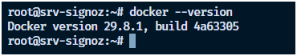
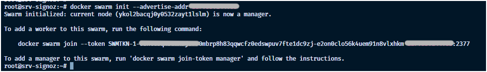
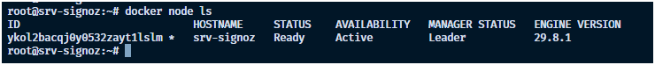
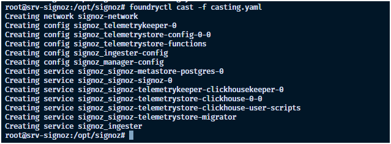
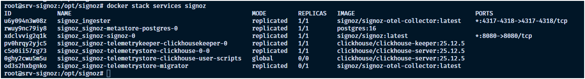
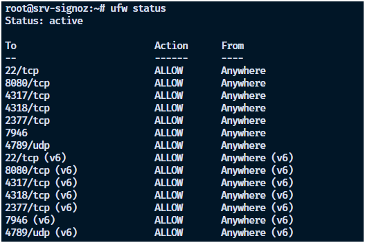
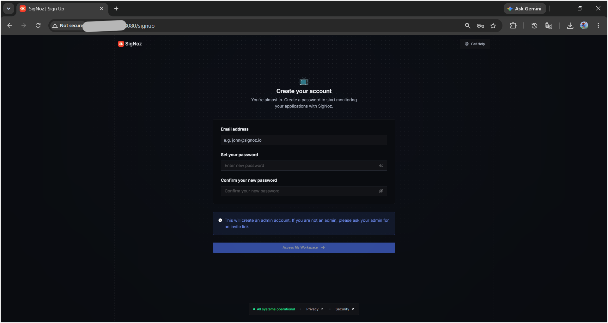
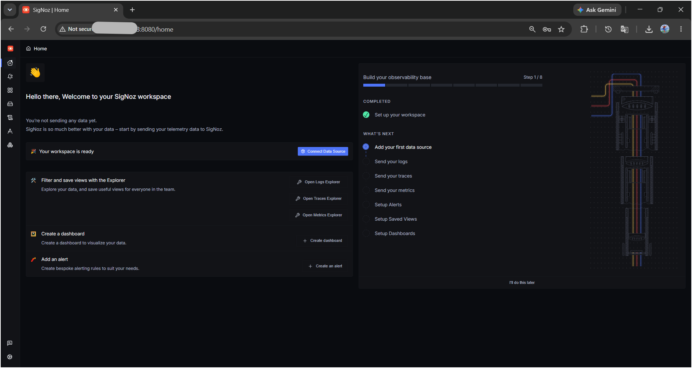
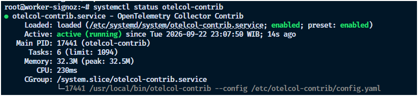
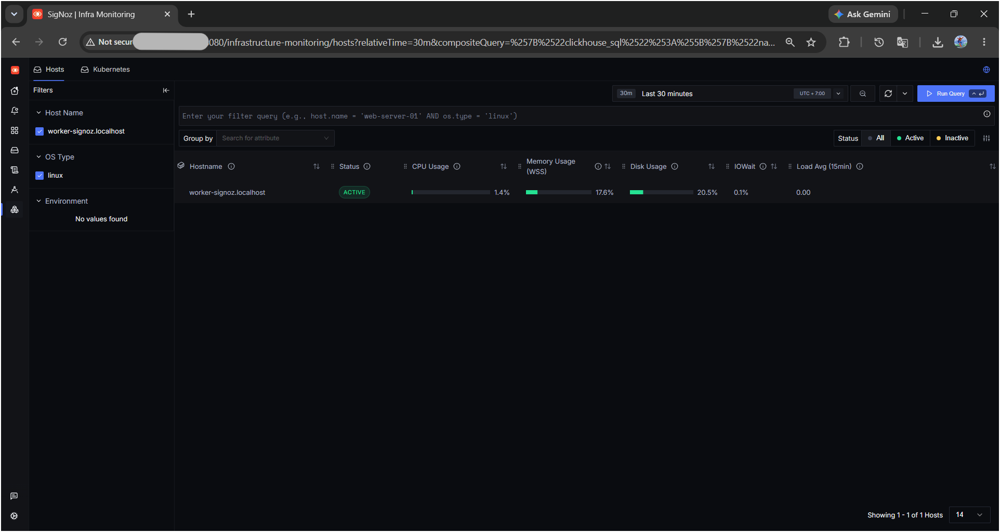

# Cara Instalasi dan Konfigurasi SigNoz Menggunakan Docker Swarm di Ubuntu 24.04

Halo, Kawan Belajar!

Selain dijalankan menggunakan Docker Standalone, **SigNoz** juga dapat dijalankan menggunakan **Docker Swarm**, salah satu fitur orkestrasi container bawaan Docker yang dapat mengelola service secara terdistribusi.

Pada panduan ini, kita akan membahas cara menginstal dan mengonfigurasi **SigNoz** menggunakan metode **Docker Swarm** pada Kilat VM dengan sistem operasi **Ubuntu 24.04 LTS**, hingga dapat menerima data observability dari server lain.

## Persiapan Awal

Sebelum memulai instalasi dan konfigurasi SigNoz, pastikan kamu sudah memiliki:

1. **Dua unit Kilat VM** dengan sistem operasi Ubuntu 24.04 LTS:
   * **VPS Utama**, digunakan sebagai Swarm manager sekaligus menjalankan SigNoz.
   * **VPS Target**, digunakan sebagai simulasi server yang akan dipantau.
2. Akses **Root** atau user dengan hak akses `sudo` pada kedua VPS.
3. **IP Address publik** pada VPS Utama.
4. Spesifikasi minimal VPS Utama: **4 GB RAM**, disarankan **8 GB RAM dan 4 vCPU**.
5. Ruang disk yang mencukupi pada VPS Utama untuk penyimpanan data monitoring.
6. Port `8080`, `4317`, dan `4318` pada VPS Utama dapat diakses dari internet.

Pada panduan ini, kita akan menggunakan contoh konfigurasi berikut:

| Konfigurasi          | Nilai             |
| --------------------- | ------------------ |
| Sistem Operasi        | Ubuntu 24.04 LTS  |
| IP Address VPS Utama  | `IP-VPS-UTAMA`    |
| IP Address VPS Target | `IP-VPS-TARGET`   |
| Port UI SigNoz        | `8080`            |
| Port OTLP gRPC        | `4317`            |
| Port OTLP HTTP        | `4318`            |

> **Catatan:** `IP-VPS-UTAMA` dan `IP-VPS-TARGET` hanya digunakan sebagai contoh. Silakan sesuaikan dengan IP Address publik yang digunakan.

## Rangkuman Versi yang Digunakan

Panduan ini menggunakan konfigurasi berikut:

| Komponen       | Versi            |
| -------------- | ---------------- |
| Sistem Operasi | Ubuntu 24.04 LTS |
| Docker Engine  | 29.6.2           |
| SigNoz         | v0.142.1         |

> **Catatan:** Versi SigNoz dan Docker dapat berubah seiring adanya release terbaru. Jalankan `docker --version` dan periksa versi SigNoz pada menu Settings setelah instalasi untuk memastikan versi yang benar-benar terpasang di server kamu.

---

## 1. Update Sistem

Sebelum melakukan instalasi, lakukan update package pada **VPS Utama** dengan menjalankan perintah berikut:

```
apt update && apt upgrade -y
apt install -y curl ca-certificates gnupg
```

> **Catatan:** Perintah pada panduan ini diasumsikan dijalankan menggunakan user `root`. Jika menggunakan user biasa, tambahkan `sudo` pada perintah yang membutuhkan hak akses administratif.

## 2. Instalasi Docker

Docker Swarm merupakan fitur bawaan Docker Engine, sehingga tidak memerlukan instalasi tambahan selain Docker Engine itu sendiri.

Tambahkan GPG key resmi Docker:

```
install -m 0755 -d /etc/apt/keyrings
curl -fsSL https://download.docker.com/linux/ubuntu/gpg -o /etc/apt/keyrings/docker.asc
chmod a+r /etc/apt/keyrings/docker.asc
```

Tambahkan repository Docker:

```
echo "deb [arch=$(dpkg --print-architecture) signed-by=/etc/apt/keyrings/docker.asc] https://download.docker.com/linux/ubuntu $(. /etc/os-release && echo "$VERSION_CODENAME") stable" | tee /etc/apt/sources.list.d/docker.list > /dev/null
```

Install Docker Engine:

```
apt update
apt install -y docker-ce docker-ce-cli containerd.io docker-buildx-plugin docker-compose-plugin
```

Pastikan Docker telah berhasil di-install:

```
docker --version
```

<p align="center">
  
  <br>
  Gambar 1: Verifikasi versi Docker Engine
</p>

Pastikan service Docker berjalan dan aktif ketika server melakukan reboot:

```
systemctl enable --now docker
systemctl status docker
```

## 3. Inisialisasi Docker Swarm

Sebelum menjalankan SigNoz, VPS Utama perlu diaktifkan sebagai **Swarm manager**.

Inisialisasi Docker Swarm dengan menentukan IP Address yang digunakan untuk komunikasi antar node:

```
docker swarm init --advertise-addr IP-VPS-UTAMA
```

<p align="center">
  
  <br>
  Gambar 2: Inisialisasi Docker Swarm
</p>

> **Catatan:** Ganti `IP-VPS-UTAMA` dengan IP Address publik atau IP internal VPS Utama. Perintah ini akan menjadikan VPS Utama sebagai satu-satunya manager node pada cluster Swarm. Apabila di kemudian hari ingin menambahkan node lain, output dari perintah ini akan menampilkan token yang dapat digunakan pada node tersebut untuk melakukan `docker swarm join`.

Verifikasi node yang terdaftar pada Swarm:

```
docker node ls
```

<p align="center">
  
  <br>
  Gambar 3: Verifikasi node Docker Swarm
</p>

Pastikan status node menunjukkan `Ready` dan `Leader`.

## 4. Instalasi SigNoz (Docker Swarm)

SigNoz di-install menggunakan tools bernama **foundryctl**, yaitu CLI resmi SigNoz untuk mengatur proses deployment, baik pada Docker Standalone maupun Docker Swarm.

Install `foundryctl`:

```
curl -fsSL https://signoz.io/foundry.sh | bash
```

Buat direktori kerja, kemudian buat file konfigurasi `casting.yaml`:

```
mkdir -p /opt/signoz && cd /opt/signoz
nano casting.yaml
```

Isi dengan konfigurasi berikut, yang menentukan target deployment berupa **Docker Swarm**:

```
apiVersion: v1alpha1
kind: Installation
metadata:
  name: signoz
spec:
  deployment:
    flavor: swarm
    mode: docker
```

> **Catatan:** Perbedaan utama dari instalasi Docker Standalone hanya terletak pada nilai `flavor`, yaitu `swarm` alih-alih `compose`.

Jalankan proses deploy pada **Swarm manager node**:

```
foundryctl cast -f casting.yaml
```

<p align="center">
  
  <br>
  Gambar 4: Proses instalasi SigNoz pada Docker Swarm
</p>

Perintah `cast` akan menghasilkan stack Compose file dari konfigurasi yang telah dibuat, kemudian menjalankannya pada Swarm cluster menggunakan `docker stack deploy`.

> **Catatan:** Metode instalasi SigNoz dapat berubah seiring adanya release terbaru. Pastikan mengikuti [dokumentasi resmi SigNoz](https://signoz.io/docs/install/docker-swarm/) pada saat instalasi dilakukan.

## 5. Verifikasi Service SigNoz pada Swarm

Berbeda dengan Docker Standalone yang diverifikasi menggunakan `docker ps`, pada Docker Swarm verifikasi dilakukan melalui `docker service` dan `docker stack`.

Periksa daftar service yang berjalan pada stack SigNoz:

```
docker stack services signoz
```

<p align="center">
  
  <br>
  Gambar 5: Verifikasi service SigNoz
</p>

Pastikan kolom `REPLICAS` pada setiap service menunjukkan jumlah yang sesuai, misalnya `1/1`, yang berarti replica service telah berjalan dengan baik.

Untuk melihat detail task dan kondisi masing-masing container pada service tertentu:

```
docker service ps signoz_signoz --no-trunc
```

| Service (contoh)         | Fungsi                                              |
| -------------------------- | ---------------------------------------------------- |
| `signoz_signoz`             | Menjalankan aplikasi dan tampilan antarmuka SigNoz  |
| `signoz_clickhouse`         | Menyimpan data metrics, traces, dan logs             |
| `signoz_otel-collector`     | Menerima data observability melalui protokol OTLP    |

> **Catatan:** Nama service dapat berbeda tergantung nama stack (`metadata.name` pada `casting.yaml`) dan versi SigNoz yang digunakan.

Untuk memeriksa log salah satu service:

```
docker service logs -f NAMA-SERVICE
```

## 6. Konfigurasi Firewall

SigNoz menggunakan beberapa port yang perlu diizinkan pada firewall **VPS Utama**.

| Port     | Protokol | Fungsi                                      |
| -------- | -------- | --------------------------------------------- |
| `8080`   | TCP      | Akses tampilan antarmuka SigNoz              |
| `4317`   | TCP      | Pengiriman data OTLP gRPC                     |
| `4318`   | TCP      | Pengiriman data OTLP HTTP                     |
| `2377`   | TCP      | Komunikasi manajemen cluster Swarm            |
| `7946`   | TCP/UDP  | Komunikasi antar node (*container network discovery*) |
| `4789`   | UDP      | Overlay network Swarm (VXLAN)                 |

Jika menggunakan UFW, jalankan:

```
ufw allow 8080/tcp
ufw allow 4317/tcp
ufw allow 4318/tcp
ufw allow 2377/tcp
ufw allow 7946
ufw allow 4789/udp
ufw status
```

<p align="center">
  
  <br>
  Gambar 6: Verifikasi status UFW
</p>

> **Catatan:** Port `2377`, `7946`, dan `4789` digunakan untuk komunikasi antar node Swarm. Karena pada panduan ini Swarm hanya terdiri dari satu node, port tersebut tidak perlu diakses dari internet dan cukup diizinkan pada firewall sebagai persiapan apabila node lain ditambahkan ke cluster di kemudian hari.
>
> Untuk port `4317` dan `4318`, karena VPS Target akan mengirim data melalui **IP publik**, kedua port tersebut perlu dapat diakses dari internet. SigNoz self-hosted secara bawaan **tidak memiliki autentikasi** pada endpoint OTLP, sehingga sebaiknya dibatasi hanya untuk IP Address VPS Target, misalnya:
>
> ```
> ufw allow from IP-VPS-TARGET to any port 4317 proto tcp
> ufw allow from IP-VPS-TARGET to any port 4318 proto tcp
> ```

## 7. Mengakses Tampilan SigNoz

Akses SigNoz melalui browser menggunakan alamat berikut:

```
http://IP-VPS-UTAMA:8080
```

Pada akses pertama, SigNoz akan meminta pembuatan akun administrator. Masukkan nama, email, dan password yang akan digunakan.

<p align="center">
  
  <br>
  Gambar 7: Pembuatan akun administrator
</p>

Setelah akun berhasil dibuat, tampilan utama SigNoz akan ditampilkan dengan kondisi Quick Stats kosong karena belum ada data yang masuk.

<p align="center">
  
  <br>
  Gambar 8: Tampilan utama SigNoz
</p>

> **Catatan:** Gunakan password yang kuat karena tampilan SigNoz dapat diakses melalui internet.

## 8. Instalasi Agent pada VPS Target

Agar SigNoz dapat menampilkan data, **VPS Target** perlu dipasangi **OpenTelemetry Collector** sebagai agent, kemudian diarahkan untuk mengirim data ke **VPS Utama** melalui IP publik. Karena VPS Target berperan sebagai simulasi server eksternal (bukan bagian dari cluster Swarm), agent dipasang menggunakan binary dan systemd, sama seperti pada metode Docker Standalone.

Login ke **VPS Target**, kemudian update sistem terlebih dahulu:

```
apt update && apt upgrade -y
apt install -y curl tar
```

### 8.1 Download OTel Collector Binary

```
cd /tmp
curl -LO https://github.com/open-telemetry/opentelemetry-collector-releases/releases/latest/download/otelcol-contrib_linux_amd64.tar.gz
tar -xzf otelcol-contrib_linux_amd64.tar.gz
mv otelcol-contrib /usr/local/bin/otelcol-contrib
chmod +x /usr/local/bin/otelcol-contrib
```

### 8.2 Membuat Konfigurasi Collector

```
mkdir -p /etc/otelcol-contrib
nano /etc/otelcol-contrib/config.yaml
```

Isi dengan konfigurasi berikut:

```
receivers:
  hostmetrics:
    collection_interval: 60s
    scrapers:
      cpu: {}
      disk: {}
      load: {}
      filesystem: {}
      memory: {}
      network: {}
      paging: {}
      process:
        mute_process_name_error: true
        mute_process_exe_error: true

processors:
  batch:
    send_batch_size: 1000
    timeout: 10s
  resourcedetection:
    detectors: [env, system]

exporters:
  otlp:
    endpoint: "IP-VPS-UTAMA:4317"
    tls:
      insecure: true

service:
  pipelines:
    metrics:
      receivers: [hostmetrics]
      processors: [batch, resourcedetection]
      exporters: [otlp]
```

> **Catatan:** Ganti `IP-VPS-UTAMA` dengan IP Address publik VPS Utama tempat SigNoz (Docker Swarm) berjalan.

### 8.3 Menjalankan Collector sebagai Service

```
nano /etc/systemd/system/otelcol-contrib.service
```

```
[Unit]
Description=OpenTelemetry Collector Contrib
After=network-online.target
Wants=network-online.target

[Service]
ExecStart=/usr/local/bin/otelcol-contrib --config /etc/otelcol-contrib/config.yaml
Restart=on-failure
RestartSec=5

[Install]
WantedBy=multi-user.target
```

```
systemctl daemon-reload
systemctl enable --now otelcol-contrib
systemctl status otelcol-contrib
```

<p align="center">
  
  <br>
  Gambar 9: Status service OTel Collector
</p>

Pastikan status menunjukkan `active (running)`. Jika terdapat error, periksa log:

```
journalctl -u otelcol-contrib -n 50 --no-pager
```

## 9. Verifikasi Data pada SigNoz

Kembali ke tampilan SigNoz pada **VPS Utama**, kemudian masuk ke menu **Infrastructure Monitoring > Hosts**.

Setelah beberapa saat, VPS Target akan muncul pada daftar host beserta metrik CPU, memory, disk, dan network.

<p align="center">
  
  <br>
  Gambar 10: Data VPS Target pada Infrastructure Monitoring
</p>

> **Catatan:** Apabila host tidak muncul, periksa kembali:
> 1. Apakah service `otelcol-contrib` pada VPS Target dalam kondisi `active (running)`.
> 2. Apakah port `4317` pada VPS Utama dapat diakses dari IP Address VPS Target.
> 3. Apakah firewall pada VPS Utama sudah mengizinkan koneksi dari IP VPS Target sesuai langkah 7.

## Troubleshooting

### Service SigNoz Tidak Kunjung Berjalan (Replicas 0/1)

Periksa detail task pada service yang bermasalah:

```
docker service ps NAMA-SERVICE --no-trunc
```

Command ini menampilkan pesan error terakhir apabila container gagal dijalankan, misalnya kekurangan resource atau kegagalan menarik image.

Periksa juga log service terkait:

```
docker service logs NAMA-SERVICE
```

### Node Berstatus Down atau Unreachable

```
docker node ls
```

Jika manager node berstatus selain `Ready`, restart service Docker:

```
systemctl restart docker
```

### Tampilan SigNoz Tidak Dapat Diakses

1. Pastikan seluruh service pada `docker stack services signoz` menunjukkan replicas yang sesuai (misalnya `1/1`).
2. Pastikan port `8080` telah diizinkan pada firewall.
3. Periksa penggunaan port dengan `ss -lntup | grep ':8080'`.

### Data dari VPS Target Tidak Muncul

1. Pastikan endpoint pada `config.yaml` VPS Target sudah sesuai dengan IP publik VPS Utama.
2. Pastikan port `4317`/`4318` pada VPS Utama dapat diakses dari VPS Target.
3. Periksa log service `otelcol-contrib` pada VPS Target melalui `journalctl -u otelcol-contrib`.

## Kesimpulan

SigNoz dapat diinstal menggunakan metode Docker Swarm pada Kilat VM dengan sistem operasi Ubuntu 24.04 LTS. Dengan menjalankan SigNoz sebagai stack pada Swarm manager node menggunakan `foundryctl`, serta menghubungkannya dengan OpenTelemetry Collector pada server lain melalui IP publik, VPS Utama dapat digunakan sebagai pusat monitoring yang siap dikembangkan menjadi cluster multi-node di kemudian hari.

Dengan mengikuti panduan ini, SigNoz telah berhasil di-install pada Docker Swarm dan terbukti dapat menerima data dari server lain. Agar penggunaan lebih optimal, pastikan akses endpoint OTLP dibatasi hanya untuk IP yang dipercaya, serta pertimbangkan menambahkan node lain ke cluster Swarm apabila membutuhkan ketersediaan (*high availability*) yang lebih tinggi.

---

CloudKilat menyediakan layanan **Kilat VM, hosting, serta berbagai layanan pendukung lainnya** dengan performa yang andal. Layanan CloudKilat juga didukung oleh tim support yang siap membantu dengan respons cepat dan pelayanan selama **7x24 jam**.

Untuk informasi lebih lanjut mengenai layanan CloudKilat, silakan kunjungi [website resmi CloudKilat](https://cloudkilat.id/).

Terima kasih, semoga panduan ini bermanfaat.

## Referensi

- [SigNoz Official Website](https://signoz.io/)
- [SigNoz Documentation - Install on Docker Swarm](https://signoz.io/docs/install/docker-swarm/)
- [SigNoz Documentation - Docker Swarm Collection Agent](https://signoz.io/docs/collection-agents/docker-swarm/install/)
- [Docker Swarm Documentation](https://docs.docker.com/engine/swarm/)
- [OpenTelemetry Collector Releases](https://github.com/open-telemetry/opentelemetry-collector-releases)
