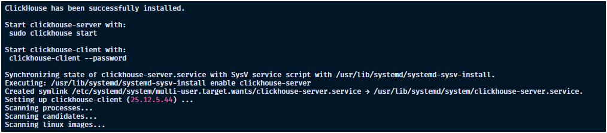
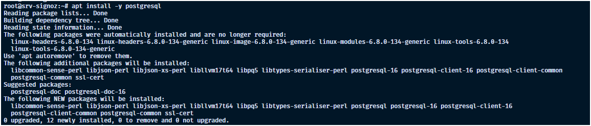
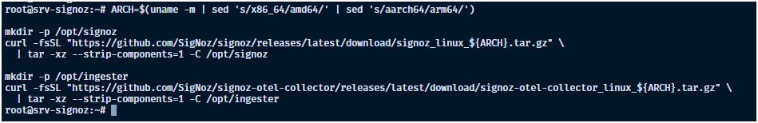
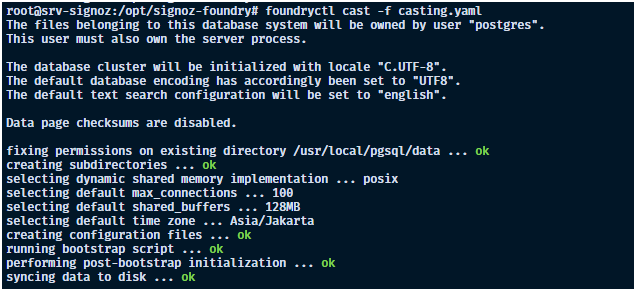
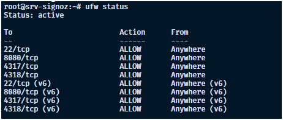
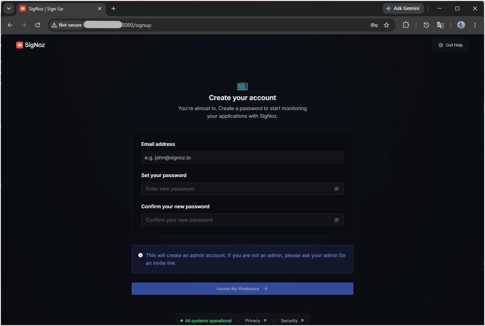
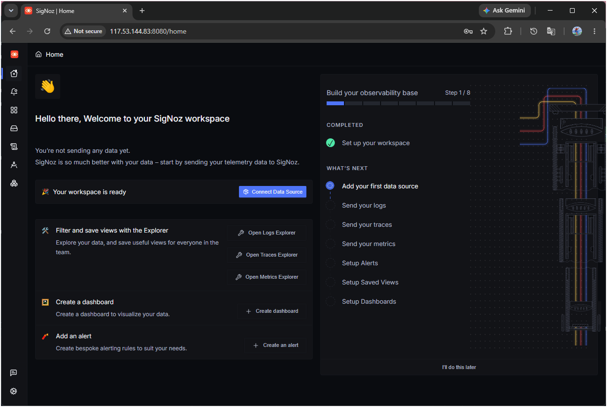
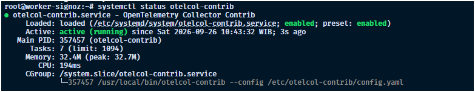
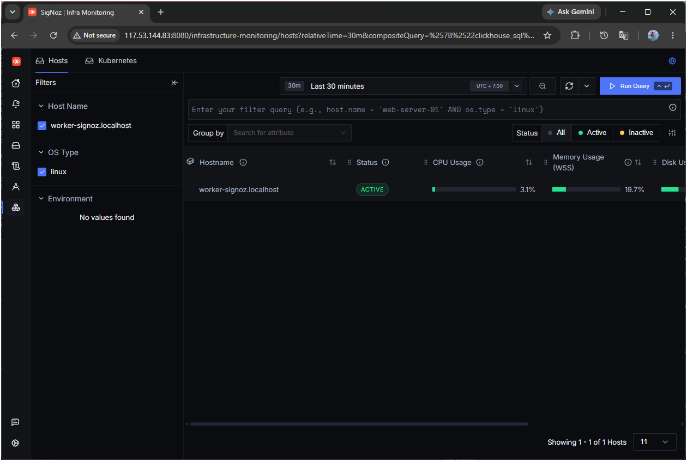

# Cara Instalasi dan Konfigurasi SigNoz Menggunakan Systemd di Ubuntu 24.04

Halo, Kawan Belajar!

Selain menggunakan Docker, **SigNoz** juga dapat dijalankan langsung pada sistem operasi menggunakan binary dan dikelola oleh **systemd**, tanpa memerlukan container sama sekali.

Pada panduan ini, kita akan membahas cara menginstal dan mengonfigurasi **SigNoz** menggunakan metode **Systemd (Binary)** pada Kilat VM dengan sistem operasi **Ubuntu 24.04 LTS**, hingga dapat menerima data observability dari server lain.

## Persiapan Awal

Sebelum memulai instalasi dan konfigurasi SigNoz, pastikan kamu sudah memiliki:

1. **Dua unit Kilat VM** dengan sistem operasi Ubuntu 24.04 LTS:
   * **VPS Utama**, digunakan untuk menjalankan SigNoz beserta seluruh komponennya sebagai service systemd.
   * **VPS Target**, digunakan sebagai simulasi server yang akan dipantau.
2. Akses **Root** atau user dengan hak akses `sudo` pada kedua VPS.
3. **IP Address publik** pada VPS Utama.
4. Spesifikasi minimal VPS Utama: **4 GB RAM**, disarankan **8 GB RAM dan 4 vCPU**.
5. Ruang disk yang mencukupi pada VPS Utama untuk penyimpanan data monitoring.
6. Port `8080`, `4317`, dan `4318` pada VPS Utama dapat diakses dari internet.

Pada panduan ini, kita akan menggunakan contoh konfigurasi berikut:

| Konfigurasi          | Nilai             |
| --------------------- | ------------------ |
| Sistem Operasi        | Ubuntu 24.04 LTS  |
| IP Address VPS Utama  | `IP-VPS-UTAMA`    |
| IP Address VPS Target | `IP-VPS-TARGET`   |
| Port UI SigNoz        | `8080`            |
| Port OTLP gRPC        | `4317`            |
| Port OTLP HTTP        | `4318`            |

> **Catatan:** `IP-VPS-UTAMA` dan `IP-VPS-TARGET` hanya digunakan sebagai contoh. Silakan sesuaikan dengan IP Address publik yang digunakan.

## Rangkuman Versi yang Digunakan

Panduan ini menggunakan konfigurasi berikut:

| Komponen        | Versi              |
| ----------------- | -------------------- |
| Sistem Operasi   | Ubuntu 24.04 LTS    |
| SigNoz           | Rilis terbaru (`latest`) |
| SigNoz OTel Collector | Rilis terbaru (`latest`) |
| ClickHouse       | 25.12.5 |
| PostgreSQL       | 16                  |

> **Catatan:** Panduan ini menggunakan binary versi `latest` yang di-download langsung dari GitHub Releases. Jalankan `systemctl status signoz-signoz.service` dan periksa menu Settings pada SigNoz untuk memastikan versi yang benar-benar terpasang di server kamu. Untuk pin ke versi tertentu, unduh arsip rilis dengan nomor versi spesifik pada langkah 4, bukan `latest`.

---

## 1. Update Sistem

Sebelum melakukan instalasi, lakukan update package pada **VPS Utama**:

```
apt update && apt upgrade -y
apt install -y curl
```

> **Catatan:** Perintah pada panduan ini diasumsikan dijalankan menggunakan user `root`. Jika menggunakan user biasa, tambahkan `sudo` pada perintah yang membutuhkan hak akses administratif.

## 2. Instalasi ClickHouse dan PostgreSQL

Berbeda dengan metode Docker, pada metode Systemd, **ClickHouse** dan **PostgreSQL** perlu di-install terlebih dahulu sebagai dependency pada host, karena Foundry hanya mengelola service-nya, bukan menginstalnya dari awal.

### 2.1 Install ClickHouse 25.12.5

Install ClickHouse mengikuti [panduan resmi ClickHouse](https://clickhouse.com/docs/install):

```
apt-get install -y apt-transport-https ca-certificates curl gnupg
curl -fsSL 'https://packages.clickhouse.com/rpm/lts/repodata/repomd.xml.key' | gpg --dearmor -o /usr/share/keyrings/clickhouse-keyring.gpg
ARCH=$(dpkg --print-architecture)
echo "deb [signed-by=/usr/share/keyrings/clickhouse-keyring.gpg arch=${ARCH}] https://packages.clickhouse.com/deb stable main" | tee /etc/apt/sources.list.d/clickhouse.list
apt-get update
```

Cek apakah versi tersedia di repositori
```
apt-cache madison clickhouse-server | grep 25.12.5
```

Install sesuai versi dan patch yang tersedia
```
apt-get install -y clickhouse-server=25.12.5.44 clickhouse-client=25.12.5.44 clickhouse-common-static=25.12.5.44
apt-mark hold clickhouse-server clickhouse-client
```

<p align="center">
  
  <br>
  Gambar 1: Instalasi ClickHouse
</p>

Karena Foundry yang akan mengelola service ClickHouse setelah deployment, nonaktifkan dahulu service bawaan package manager:

```
systemctl disable --now clickhouse-server.service clickhouse-keeper.service 2>/dev/null || true
```

> **Catatan:** Satu binary `clickhouse` sudah mencakup fungsi telemetry store maupun keeper, sehingga tidak diperlukan package Keeper terpisah.

### 2.2 Install PostgreSQL

Install PostgreSQL mengikuti [panduan resmi PostgreSQL untuk Linux](https://www.postgresql.org/download/linux/), misalnya melalui repository default Ubuntu:

```
apt install -y postgresql
```

<p align="center">
  
  <br>
  Gambar 2: Instalasi PostgreSQL
</p>

Nonaktifkan service bawaan package manager, karena akan dikelola oleh Foundry:

```
systemctl disable --now postgresql.service
```

Catat lokasi binary `postgres`, karena akan digunakan pada konfigurasi Foundry. Pada Ubuntu, binary PostgreSQL umumnya berada di:

```
/usr/lib/postgresql/<versi>/bin
```

Periksa versi dan lokasi persisnya:

```
ls /usr/lib/postgresql/
```

## 3. Instalasi foundryctl

Install `foundryctl`, CLI resmi SigNoz untuk mengatur proses deployment:

```
curl -fsSL https://signoz.io/foundry.sh | bash
```

## 4. Download Binary SigNoz dan SigNoz OTel Collector

Download arsip rilis SigNoz dan SigNoz OTel Collector ke path yang digunakan oleh Foundry:

```
ARCH=$(uname -m | sed 's/x86_64/amd64/' | sed 's/aarch64/arm64/')

mkdir -p /opt/signoz
curl -fsSL "https://github.com/SigNoz/signoz/releases/latest/download/signoz_linux_${ARCH}.tar.gz" \
  | tar -xz --strip-components=1 -C /opt/signoz

mkdir -p /opt/ingester
curl -fsSL "https://github.com/SigNoz/signoz-otel-collector/releases/latest/download/signoz-otel-collector_linux_${ARCH}.tar.gz" \
  | tar -xz --strip-components=1 -C /opt/ingester
```

<p align="center">
  
  <br>
  Gambar 3: Download binary SigNoz
</p>

> **Catatan:** Ekstrak seluruh isi arsip apa adanya, jangan hanya memindahkan binary `signoz` secara terpisah. Binary tersebut memuat web UI serta template email/alert secara relatif terhadap lokasinya sendiri, sehingga folder `bin/`, `web/`, `templates/`, dan `conf/` harus tetap berada dalam satu direktori yang sama. User dan direktori data untuk service `signoz` akan dibuat otomatis oleh `foundryctl cast` pada langkah berikutnya.

Simpan PATH Secara Permanen:
```
echo 'export PATH="/root/.local/bin:$PATH"' >> ~/.bashrc
source ~/.bashrc
```

## 5. Membuat Konfigurasi casting.yaml

Buat direktori kerja di luar `/root`, agar file `pours/` yang dihasilkan tetap dapat dibaca oleh user sistem `signoz`:

```
mkdir -p /opt/signoz-foundry
cd /opt/signoz-foundry
```

Buat file `casting.yaml`:

```
nano casting.yaml
```

Isi dengan konfigurasi berikut untuk deployment berbasis binary dan systemd:

```
apiVersion: v1alpha1
kind: Installation
metadata:
  name: signoz
  annotations:
    foundry.signoz.io/metastore-postgres-binary-path: /usr/lib/postgresql/16/bin/postgres
spec:
  deployment:
    flavor: binary
    mode: systemd
```

> **Catatan:** Apabila binary `postgres` tidak berada di `/usr/bin/postgres` (sesuai catatan pada langkah 2.2), tambahkan binary-path annotation di bagian `metadata`, misalnya:
>
> ```
> metadata:
>   name: signoz
>   annotations:
>     foundry.signoz.io/metastore-postgres-binary-path: /usr/lib/postgresql/16/bin/postgres
> ```

## 6. Deploy SigNoz Menggunakan Foundry

Jalankan proses deploy penuh:

```
foundryctl cast -f casting.yaml
```

<p align="center">
  
  <br>
  Gambar 4: Proses deploy SigNoz
</p>

Perintah `cast` akan memvalidasi dependency, menghasilkan file konfigurasi dan service pada direktori `pours/`, menginstal unit systemd, kemudian menjalankan seluruh service SigNoz.

> **Catatan:** `foundryctl cast` membutuhkan `sudo` karena perlu menulis pada direktori sistem dan mengelola service systemd.

## 7. Verifikasi Instalasi

Periksa status service utama yang telah berjalan:

```
systemctl status signoz-signoz.service
systemctl status signoz-ingester.service
systemctl status signoz-telemetrystore-clickhouse-0-0.service
systemctl status signoz-telemetrykeeper-clickhousekeeper-0.service
systemctl status signoz-metastore-postgres.service
```

Pastikan setiap service menunjukkan status `active (running)`.

| Service                                              | Fungsi                                                |
| ----------------------------------------------------- | ------------------------------------------------------ |
| `signoz-signoz.service`                               | Menjalankan aplikasi dan tampilan antarmuka SigNoz    |
| `signoz-ingester.service`                             | Menerima data observability melalui protokol OTLP      |
| `signoz-telemetrystore-clickhouse-0-0.service`        | Menyimpan data metrics, traces, dan logs (ClickHouse)  |
| `signoz-telemetrykeeper-clickhousekeeper-0.service`   | Koordinasi ClickHouse Keeper                            |
| `signoz-metastore-postgres.service`                   | Menyimpan metadata SigNoz (PostgreSQL)                  |

Untuk melihat log seluruh service SigNoz secara realtime:

```
journalctl -u 'signoz-*' -f
```

Untuk melihat log salah satu service:

```
journalctl -u signoz-signoz.service -f
```

## 8. Penyesuaian SELinux (Khusus Distro Berbasis RHEL)

Ubuntu menggunakan **AppArmor**, bukan SELinux, sehingga langkah pada bagian ini **tidak diperlukan** apabila mengikuti panduan ini pada Ubuntu 24.04. Bagian ini disediakan sebagai referensi tambahan apabila instalasi Systemd dijalankan pada distro berbasis RHEL (CentOS, Rocky Linux, atau AlmaLinux) dengan SELinux dalam mode `enforcing`.

Karena metode Systemd menjalankan seluruh proses (SigNoz, ClickHouse, PostgreSQL) langsung pada host tanpa container, potensi konflik SELinux umumnya muncul pada akses direktori data (`/var/lib/clickhouse`, `/var/lib/signoz`, data PostgreSQL) yang memiliki *security context* berbeda dari context default aplikasi tersebut.

Periksa status SELinux:

```
sestatus
```

Jika terdapat proses yang diblokir, periksa log audit:

```
ausearch -m avc -ts recent
```

Untuk mengembalikan context default suatu direktori data:

```
restorecon -Rv /var/lib/clickhouse
restorecon -Rv /var/lib/signoz
```

Apabila proses tetap diblokir setelah `restorecon`, policy khusus dapat dibuat menggunakan `audit2allow`:

```
ausearch -m avc -ts recent | audit2allow -M signoz-policy
semodule -i signoz-policy.pp
```

> **Catatan:** Penggunaan `audit2allow` sebaiknya dilakukan dengan hati-hati karena dapat memberikan izin yang lebih luas dari yang seharusnya. Lakukan pengujian langsung pada distro terkait, karena kebutuhan penyesuaian SELinux untuk proses non-container seperti ini dapat berbeda dari kasus Docker maupun Docker Swarm yang sudah dibahas pada artikel sebelumnya.

## 9. Konfigurasi Firewall

SigNoz menggunakan beberapa port yang perlu diizinkan pada firewall **VPS Utama**.

| Port   | Protokol | Fungsi                          |
| ------ | -------- | -------------------------------- |
| `8080` | TCP      | Akses tampilan antarmuka SigNoz |
| `4317` | TCP      | Pengiriman data OTLP gRPC        |
| `4318` | TCP      | Pengiriman data OTLP HTTP        |

Jika menggunakan UFW, jalankan:

```
ufw allow 8080/tcp
ufw allow 4317/tcp
ufw allow 4318/tcp
ufw status
```

<p align="center">
  
  <br>
  Gambar 5: Verifikasi status UFW
</p>

> **Catatan:** Karena pada panduan ini VPS Target akan mengirim data melalui **IP publik**, port `4317` dan `4318` perlu dapat diakses dari internet. SigNoz self-hosted secara bawaan **tidak memiliki autentikasi** pada endpoint OTLP, sehingga sebaiknya dibatasi hanya untuk IP Address VPS Target, misalnya:
>
> ```
> ufw allow from IP-VPS-TARGET to any port 4317 proto tcp
> ufw allow from IP-VPS-TARGET to any port 4318 proto tcp
> ```

## 10. Mengakses Tampilan SigNoz

Akses SigNoz melalui browser menggunakan alamat berikut:

```
http://IP-VPS-UTAMA:8080
```

Pada akses pertama, SigNoz akan meminta pembuatan akun administrator. Masukkan nama, email, dan password yang akan digunakan.

<p align="center">
  
  <br>
  Gambar 6: Pembuatan akun administrator
</p>

Setelah akun berhasil dibuat, tampilan utama SigNoz akan ditampilkan dengan kondisi Quick Stats kosong karena belum ada data yang masuk.

<p align="center">
  
  <br>
  Gambar 7: Tampilan utama SigNoz
</p>

> **Catatan:** Gunakan password yang kuat karena tampilan SigNoz dapat diakses melalui internet.

## 11. Instalasi Agent pada VPS Target

Agar SigNoz dapat menampilkan data, **VPS Target** perlu dipasangi **OpenTelemetry Collector** sebagai agent, kemudian diarahkan untuk mengirim data ke **VPS Utama** melalui IP publik.

Login ke **VPS Target**, kemudian update sistem terlebih dahulu:

```
apt update && apt upgrade -y
apt install -y curl tar
```

### 11.1 Download OTel Collector Binary

```
cd /tmp
curl -LO https://github.com/open-telemetry/opentelemetry-collector-releases/releases/latest/download/otelcol-contrib_linux_amd64.tar.gz
tar -xzf otelcol-contrib_linux_amd64.tar.gz
mv otelcol-contrib /usr/local/bin/otelcol-contrib
chmod +x /usr/local/bin/otelcol-contrib
```

### 11.2 Membuat Konfigurasi Collector

```
mkdir -p /etc/otelcol-contrib
nano /etc/otelcol-contrib/config.yaml
```

Isi dengan konfigurasi berikut:

```
receivers:
  hostmetrics:
    collection_interval: 60s
    scrapers:
      cpu: {}
      disk: {}
      load: {}
      filesystem: {}
      memory: {}
      network: {}
      paging: {}
      process:
        mute_process_name_error: true
        mute_process_exe_error: true

processors:
  batch:
    send_batch_size: 1000
    timeout: 10s
  resourcedetection:
    detectors: [env, system]

exporters:
  otlp:
    endpoint: "IP-VPS-UTAMA:4317"
    tls:
      insecure: true

service:
  pipelines:
    metrics:
      receivers: [hostmetrics]
      processors: [batch, resourcedetection]
      exporters: [otlp]
```

> **Catatan:** Ganti `IP-VPS-UTAMA` dengan IP Address publik VPS Utama tempat SigNoz (Systemd) berjalan.

### 11.3 Menjalankan Collector sebagai Service

```
nano /etc/systemd/system/otelcol-contrib.service
```

```
[Unit]
Description=OpenTelemetry Collector Contrib
After=network-online.target
Wants=network-online.target

[Service]
ExecStart=/usr/local/bin/otelcol-contrib --config /etc/otelcol-contrib/config.yaml
Restart=on-failure
RestartSec=5

[Install]
WantedBy=multi-user.target
```

```
systemctl daemon-reload
systemctl enable --now otelcol-contrib
systemctl status otelcol-contrib
```

<p align="center">
  
  <br>
  Gambar 8: Status service OTel Collector
</p>

Pastikan status menunjukkan `active (running)`. Jika terdapat error, periksa log:

```
journalctl -u otelcol-contrib -n 50 --no-pager
```

## 12. Verifikasi Data pada SigNoz

Kembali ke tampilan SigNoz pada **VPS Utama**, kemudian masuk ke menu **Infrastructure Monitoring > Hosts**.

Setelah beberapa saat, VPS Target akan muncul pada daftar host beserta metrik CPU, memory, disk, dan network.

<p align="center">
  
  <br>
  Gambar 9: Data VPS Target pada Infrastructure Monitoring
</p>

> **Catatan:** Apabila host tidak muncul, periksa kembali:
> 1. Apakah service `otelcol-contrib` pada VPS Target dalam kondisi `active (running)`.
> 2. Apakah port `4317` pada VPS Utama dapat diakses dari IP Address VPS Target.
> 3. Apakah firewall pada VPS Utama sudah mengizinkan koneksi dari IP VPS Target sesuai langkah 9.
> 4. Apakah service `signoz-ingester.service` pada VPS Utama dalam kondisi `active` dan listen pada port `4317`/`4318` (`sudo ss -ltnp | grep -E ':4317|:4318'`).

## Troubleshooting

### `foundryctl cast` Gagal

Jalankan ulang dengan opsi `--debug` untuk log yang lebih rinci:

```
sudo foundryctl cast -f casting.yaml --debug
```

### `sudo` Tidak Menemukan `foundryctl`

```
sudo env "PATH=$PATH" foundryctl cast -f casting.yaml
```

Atau install `foundryctl` ke path sistem seperti `/usr/local/bin`.

### ClickHouse Gagal Terhubung ke Keeper pada Ubuntu

Pada beberapa host Ubuntu, `localhost` dapat ter-resolve ke `::1` terlebih dahulu, sedangkan ClickHouse Keeper listen pada IPv4. Apabila `signoz-telemetrystore-clickhouse-0-0.service` gagal start, ganti `localhost` menjadi `127.0.0.1` pada konfigurasi yang dihasilkan:

```
sed -i 's/host: localhost/host: 127.0.0.1/' /etc/clickhouse-server/config-0-0.yaml
systemctl restart signoz-telemetrystore-clickhouse-0-0.service
```

Periksa kembali log service:

```
journalctl -u signoz-telemetrystore-clickhouse-0-0.service -f
```

> **Catatan:** Perubahan ini tidak bertahan setelah `recast`. `foundryctl cast` akan meregenerasi konfigurasi ClickHouse dan menimpa perubahan tersebut, sehingga `cast` berikutnya (misalnya saat mengaktifkan fitur tambahan) dapat memunculkan kembali error yang sama. Untuk membuat perubahan ini permanen, atur host Keeper ke `127.0.0.1` melalui `config.data` pada komponen ClickHouse di `casting.yaml` agar diterapkan otomatis oleh Foundry setiap kali `cast` dijalankan.

### Migrator Gagal Setelah Mengganti Versi ClickHouse

Apabila kamu sempat menjalankan instalasi dengan ClickHouse versi yang tidak di-pin (misalnya versi `latest`) lalu berpindah ke versi yang di-pin sesuai langkah 2.1, migrasi dapat gagal dengan beberapa gejala berikut, tergantung sejauh mana instalasi sebelumnya sempat berjalan:

**Gejala 1 — Keeper gagal start dengan error `Unsupported snapshot version`:**

```
Failure to load from latest snapshot with index ...: Code: 287. DB::Exception: Unsupported snapshot version 8. (UNKNOWN_FORMAT_VERSION)
```

Ini terjadi karena snapshot data Keeper di disk ditulis oleh versi ClickHouse yang lebih baru, dan tidak bisa dibaca oleh versi yang lebih lama. Karena ini biasanya terjadi pada instalasi baru yang belum memiliki data produksi, snapshot yang bermasalah dapat dihapus:

```
systemctl stop signoz-telemetrykeeper-clickhousekeeper-0.service
rm -rf /var/lib/clickhouse/coordination/snapshots/*
rm -rf /var/lib/clickhouse/coordination/log/*
systemctl start signoz-telemetrykeeper-clickhousekeeper-0.service
```

**Gejala 2 — Migrator gagal dengan `Table is in readonly mode ... metadata was not found in zookeeper`:**

Muncul setelah Gejala 1 diperbaiki, apabila hanya data Keeper yang dihapus sedangkan data ClickHouse (tabel `Replicated*` yang sempat berhasil dibuat) tetap dibiarkan. Tabel-tabel tersebut mendaftarkan dirinya ke Keeper untuk keperluan replikasi, sehingga begitu Keeper direset tanpa turut mereset ClickHouse, terjadi ketidaksesuaian metadata.

Solusinya, reset **kedua sisi sekaligus** (data Keeper dan data ClickHouse) agar keduanya mulai dari kondisi kosong yang konsisten satu sama lain:

```
systemctl stop signoz-telemetrystore-migrator.service
systemctl stop signoz-ingester.service
systemctl stop signoz-signoz.service
systemctl stop signoz-telemetrystore-clickhouse-0-0.service
systemctl stop signoz-telemetrykeeper-clickhousekeeper-0.service

rm -rf /var/lib/clickhouse/coordination/snapshots/*
rm -rf /var/lib/clickhouse/coordination/log/*
rm -rf /var/lib/clickhouse/data/*
rm -rf /var/lib/clickhouse/metadata/*
rm -rf /var/lib/clickhouse/store/*

systemctl start signoz-telemetrykeeper-clickhousekeeper-0.service
sleep 10
systemctl start signoz-telemetrystore-clickhouse-0-0.service
sleep 5
systemctl start signoz-telemetrystore-migrator.service
```

> **Catatan:** Perintah `rm -rf` di atas menghapus seluruh data telemetry yang tersimpan. Jangan jalankan pada instalasi yang sudah memiliki data produksi tanpa backup terlebih dahulu. Untuk mencegah kondisi ini sejak awal, pastikan mengikuti pin versi ClickHouse pada langkah 2.1 sebelum menjalankan `foundryctl cast` pertama kali, alih-alih memperbaikinya belakangan setelah data sempat ditulis dengan versi yang salah.

### Service SigNoz Gagal Setelah Cast

Periksa unit dan log dari service yang bermasalah:

```
systemctl status NAMA-SERVICE
journalctl -u NAMA-SERVICE -n 200 --no-pager
```

### Migrasi Database Gagal

Periksa apakah ClickHouse merespons dengan baik:

```
curl -s http://localhost:8123/ping
```

Respons yang diharapkan adalah `Ok.`.

### Telemetry Tidak Kunjung Masuk

Periksa apakah Collector berjalan dan listen pada port OTLP:

```
systemctl status signoz-ingester.service
sudo ss -ltnp | grep -E ':4317|:4318'
```

Apabila service dan agent di kedua sisi (VPS Utama dan VPS Target) sudah sama-sama sehat tetapi data tetap tidak muncul, penyebab yang paling sering terlewat adalah **firewall di VPS Utama**, terutama apabila rule sempat ditambahkan lalu VPS Utama mengalami banyak restart service selama proses troubleshooting lain. Verifikasi ulang:

```
ufw status
```

Pastikan port `8080`, `4317`, dan `4318` masih terdaftar. Uji langsung konektivitasnya dari VPS Target:

## Kesimpulan

SigNoz dapat diinstal menggunakan metode Systemd (Binary) pada Kilat VM dengan sistem operasi Ubuntu 24.04 LTS, tanpa memerlukan Docker sama sekali. Dengan menggunakan Foundry untuk mengelola seluruh unit systemd (SigNoz, ClickHouse, ClickHouse Keeper, PostgreSQL, dan SigNoz OTel Collector), proses instalasi tetap dapat dilakukan secara deklaratif meskipun berjalan langsung pada host.

Dengan mengikuti panduan ini, SigNoz telah berhasil di-install sebagai service systemd dan terbukti dapat menerima data dari server lain. Agar penggunaan lebih optimal, pastikan akses endpoint OTLP dibatasi hanya untuk IP yang dipercaya, serta lakukan monitoring terhadap resource ClickHouse dan PostgreSQL secara berkala karena keduanya berjalan langsung pada host tanpa isolasi container.

---

CloudKilat menyediakan layanan **Kilat VM, hosting, serta berbagai layanan pendukung lainnya** dengan performa yang andal. Layanan CloudKilat juga didukung oleh tim support yang siap membantu dengan respons cepat dan pelayanan selama **7x24 jam**.

Untuk informasi lebih lanjut mengenai layanan CloudKilat, silakan kunjungi [website resmi CloudKilat](https://cloudkilat.id/).

Terima kasih, semoga panduan ini bermanfaat.

## Referensi

- [SigNoz Official Website](https://signoz.io/)
- [SigNoz Documentation - Install on Linux with systemd](https://signoz.io/docs/install/linux/)
- [ClickHouse Official Installation Guide](https://clickhouse.com/docs/install)
- [PostgreSQL Official Linux Installation Guide](https://www.postgresql.org/download/linux/)
- [Foundry Systemd Binary Example](https://github.com/SigNoz/foundry/tree/main/docs/examples/systemd/binary)
- [OpenTelemetry Collector Releases](https://github.com/open-telemetry/opentelemetry-collector-releases)
