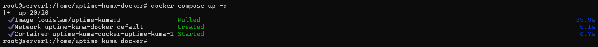
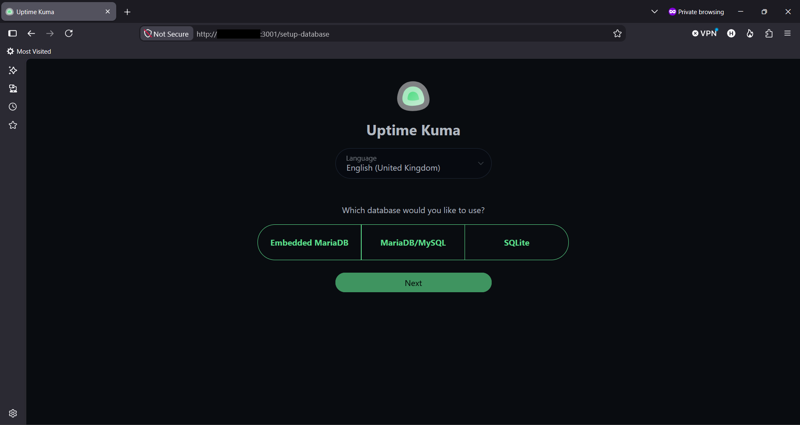
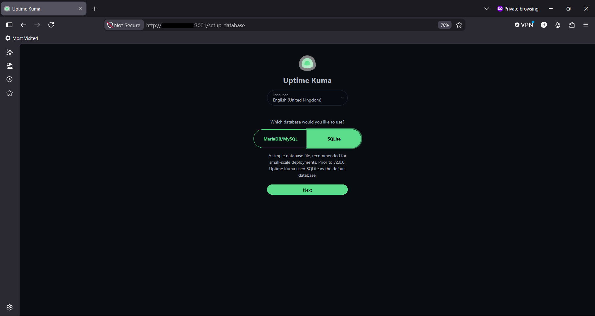

# Cara Instalasi Uptime Kuma di Linux dengan Docker

Halo, Kawan Belajar! Artikel ini membahas cara instalasi **Uptime Kuma** pada server Linux menggunakan metode **Docker**, mulai dari persiapan, konfigurasi Docker Compose, pilihan database (termasuk MariaDB eksternal), hingga berhasil login dan sampai ke halaman utama dashboard.

> **Catatan:** Belum tahu apa itu Uptime Kuma? Baca dulu artikel [Apa Itu Uptime Kuma? Mengenal Tool Monitoring Uptime Self-Hosted](Apa_Itu_Uptime_Kuma_Mengenal_Tool_Monitoring_Uptime_Self-Hosted.md). Apabila ingin instalasi tanpa Docker, lihat artikel [Cara Instalasi Uptime Kuma di Linux dengan NPM (Non-Docker/Native)](Cara_Instalasi_Uptime_Kuma_di_Linux_dengan_NPM.md).

## Persiapan Awal

Sebelum memulai instalasi Uptime Kuma, pastikan kamu sudah memiliki:

1. **VPS** dengan sistem operasi Ubuntu 24.04 LTS (atau distribusi Linux lain, lihat bagian [Kompatibilitas Sistem Operasi](#kompatibilitas-sistem-operasi)).
2. Akses **Root** atau user dengan hak akses `sudo`.
3. **IP Address publik** pada VPS.
4. Spesifikasi minimum: 1 vCPU, 1 GB RAM, 10 GB storage. Sudah cukup untuk kebutuhan 20-50 monitor.
5. Port `22/tcp` (SSH) dan `3001/tcp` (akses dashboard Uptime Kuma) dapat diakses dari internet.

## Rangkuman Versi yang Digunakan

Panduan ini menggunakan konfigurasi berikut:

| Komponen        | Versi                          |
| ---------------- | ------------------------------- |
| Sistem Operasi   | Ubuntu 24.04 LTS                |
| Uptime Kuma      | Image `louislam/uptime-kuma:2` |

> **Catatan:** Tag Docker `:2` **bukan** berarti versi 2.0, melainkan *major-version tag* yang selalu mengikuti rilis stabil terbaru dari seri v2 (`2.x.x`). Pada saat panduan ini ditulis, tag `:2` mengarah ke rilis **2.5.4**. Untuk pin ke versi tertentu, gunakan tag spesifik seperti `2.5.4`.

## Kompatibilitas Sistem Operasi

Uptime Kuma dengan metode Docker dapat dijalankan pada berbagai distribusi Linux, selama Docker Engine dan Docker Compose plugin sudah terinstal. Perbedaan antar distribusi hanya terletak pada perintah instalasi Docker itu sendiri, sedangkan langkah instalasi Uptime Kuma di dalamnya tetap sama karena berjalan di dalam container yang sudah membawa environment-nya sendiri.

| Distribusi                        | Package Manager | Catatan                                                              |
| ---------------------------------- | ---------------- | ---------------------------------------------------------------------- |
| Ubuntu / Debian                    | `apt`            | Digunakan pada panduan ini.                                            |
| CentOS / Rocky Linux / AlmaLinux   | `dnf` / `yum`    | Nama paket dependency seperti `docker` umumnya tersedia langsung di repository, namun beberapa paket tambahan mungkin memerlukan repository EPEL. |

---

## 1. Update Sistem

Sebelum melakukan instalasi Uptime Kuma, lakukan update package pada Ubuntu dengan menjalankan perintah berikut:

```bash
apt update && apt upgrade -y
```

---

## 2. Install Docker Engine

Apabila Docker belum terinstal pada VPS, install menggunakan script resmi Docker:

```bash
curl -fsSL https://get.docker.com -o get-docker.sh
sh get-docker.sh
```

Verifikasi instalasi Docker dan Docker Compose plugin:

```bash
docker -v
docker compose version
```

<p align="center">

  <br>
  <em>Gambar 1: Verifikasi Versi Docker dan Docker Compose</em>
</p>

> **Catatan:** Apabila Docker sudah terinstal sebelumnya pada VPS, langkah ini dapat dilewati.

---

## 3. Membuat Direktori dan File Compose

Buat direktori kerja untuk Uptime Kuma:

```bash
mkdir -p /home/uptime-kuma-docker
cd /home/uptime-kuma-docker
```

Download `compose.yaml` resmi dari repository Uptime Kuma:

```bash
curl -o compose.yaml https://raw.githubusercontent.com/louislam/uptime-kuma/master/compose.yaml
```

Isi default file `compose.yaml` adalah sebagai berikut:

```yaml
services:
  uptime-kuma:
    image: louislam/uptime-kuma:2
    restart: unless-stopped
    volumes:
      - ./data:/app/data
    ports:
      # <Host Port>:<Container Port>
      - "3001:3001"
```

> **Catatan:** Volume `./data:/app/data` wajib mengarah ke direktori lokal atau Docker volume, bukan ke filesystem jaringan seperti NFS, karena SQLite/Embedded MariaDB membutuhkan dukungan POSIX file lock agar tidak terjadi database corruption.

Apabila ingin mengganti port host, sesuaikan bagian `ports` sesuai kebutuhan, misalnya `"8080:3001"`.

---

## 4. Menjalankan Service Uptime Kuma (Docker Compose)

Jalankan container menggunakan Docker Compose:

```bash
docker compose up -d
```

<p align="center">

  <br>
  <em>Gambar 2: Menjalankan docker compose up -d</em>
</p>

Verifikasi container berjalan:

```bash
docker ps
```

<p align="center">

  <br>
  <em>Gambar 3: Menjalankan docker ps</em>
</p>

Status container harus menunjukkan kondisi `Up`.

### Menghentikan dan Mengelola Service Uptime Kuma (Docker Compose)

Beberapa command Docker Compose yang berguna untuk mengelola service Uptime Kuma:

```bash
# Menghentikan container tanpa menghapusnya
docker compose stop

# Menjalankan kembali container yang sudah dihentikan
docker compose start

# Merestart container
docker compose restart

# Menghentikan dan menghapus container (data pada volume tetap aman)
docker compose down

# Melihat log container secara realtime
docker compose logs -f
```

Restart otomatis saat reboot server sudah tertangani oleh nilai `restart: unless-stopped` pada `compose.yaml`, sehingga tidak diperlukan konfigurasi tambahan.

---

## 5. Pilihan Database

Pada halaman setup wizard (dibahas di bagian [Akses Website dan Setup Database dengan Akun Admin](#6-akses-website-dan-setup-database-dengan-akun-admin)), Uptime Kuma dengan Docker image full (tag `2`) menyediakan tiga pilihan database:

| Pilihan | Keterangan |
| --- | --- |
| **SQLite** | Database disimpan sebagai file di dalam direktori data (`/app/data`). Tidak perlu instalasi database server maupun pembuatan database/user manual. Direkomendasikan untuk kebanyakan kasus dan deployment berskala kecil. |
| **Embedded MariaDB** | MariaDB sudah dibundel dan dikonfigurasi otomatis oleh image, diakses melalui Unix socket. Tidak perlu `apt install mariadb-server` maupun `CREATE DATABASE`/`CREATE USER` manual — cukup pilih opsi ini pada wizard. |
| **MariaDB/MySQL (eksternal)** | Menghubungkan Uptime Kuma ke database MariaDB/MySQL yang terpisah dari container. Database, user, dan privilege harus disiapkan lebih dulu, lalu kredensialnya diisi pada wizard. |

> **Catatan:** Meskipun memilih Embedded MariaDB, volume `./data:/app/data` pada `compose.yaml` tetap wajib dipetakan ke direktori lokal atau Docker volume, karena data MariaDB tersebut tetap disimpan di dalam path tersebut. Menghapus container tanpa persistent volume akan menghilangkan seluruh data.

Bagian berikut menjelaskan cara menghubungkan Uptime Kuma Docker ke **MariaDB/MySQL eksternal**. Lewati bagian ini apabila menggunakan SQLite atau Embedded MariaDB.

### 5.1 (Opsional/Advanced) Menghubungkan ke MariaDB/MySQL Eksternal

Database eksternal dapat berupa MariaDB yang sudah terinstal pada server yang sama (di luar container Docker), pada server terpisah, maupun layanan database cloud. Database, user, dan privilege harus dibuat khusus untuk Uptime Kuma, terpisah dari database aplikasi/website lain, karena form setup Uptime Kuma hanya melakukan koneksi ke database yang sudah ada dan tidak membuatnya secara otomatis.

Apabila MariaDB belum terinstal pada server (host), install terlebih dahulu:

```bash
apt install mariadb-server -y
systemctl enable --now mariadb
```

(Opsional, direkomendasikan) Hardening instalasi:

```bash
mysql_secure_installation
```

Login ke MariaDB:

```bash
mariadb -u root -p
```

Buat database, user dedicated, dan privilege:

```sql
CREATE DATABASE kuma;
CREATE USER 'kuma_user'@'%' IDENTIFIED BY 'PASSWORD_KUAT';
GRANT ALL PRIVILEGES ON kuma.* TO 'kuma_user'@'%';
FLUSH PRIVILEGES;
EXIT;
```

> **Catatan:** User dibuat dengan host `'%'` (bukan `'localhost'`) karena koneksi dari dalam container Docker menuju MariaDB di host tidak dianggap sebagai koneksi `localhost` oleh MariaDB. Batasi akses ini lebih lanjut menggunakan firewall pada level jaringan apabila diperlukan.

Karena Uptime Kuma berjalan di dalam container sedangkan MariaDB berada pada host, MariaDB perlu dikonfigurasi agar dapat menerima koneksi dari luar `localhost`. Sunting file konfigurasi bind-address MariaDB:

```bash
nano /etc/mysql/mariadb.conf.d/50-server.cnf
```

Ubah nilai `bind-address` menjadi `0.0.0.0` (menerima koneksi dari semua interface) atau ke IP internal Docker bridge network sesuai kebutuhan, lalu restart service:

```bash
systemctl restart mariadb
```

Kredensial di atas (`kuma_user`, `kuma`) akan dimasukkan pada halaman setup database di bagian selanjutnya. Sebagai Hostname pada wizard, gunakan `host.docker.internal` (apabila didukung oleh environment Docker yang digunakan) atau IP internal host pada jaringan Docker bridge, **bukan** `localhost`, karena `localhost` di dalam container merujuk ke container itu sendiri, bukan ke host.

> **Catatan:** Apabila MariaDB berada pada server terpisah dari VPS Uptime Kuma, gunakan IP Address atau hostname server MariaDB tersebut sebagai Hostname, dan pastikan port `3306` dapat diakses dari VPS Uptime Kuma melalui firewall.

---

## 6. Akses Website dan Setup Database dengan Akun Admin

Akses Uptime Kuma melalui `http://IP_VPS:3001` pada browser, ganti `IP_VPS` dengan IP Address publik VPS yang digunakan.

<p align="center">

  <br>
  <em>Gambar 4: Halaman Awal Setup Wizard Uptime Kuma Saat Pertama Kali Diakses</em>
</p>

Pilih tipe database sesuai yang tersedia pada wizard (lihat kembali bagian [Pilihan Database](#5-pilihan-database) untuk penjelasan masing-masing opsi):

* **Embedded MariaDB**: tidak perlu input tambahan, langsung klik Next.
* **SQLite**: tidak perlu input tambahan, langsung klik Next. Direkomendasikan untuk kebanyakan kasus.
* **MariaDB/MySQL**: isi Hostname (`host.docker.internal` atau IP internal host apabila MariaDB berada pada host yang sama, atau IP server terpisah), Port (`3306`), Username, Password, dan Database Name sesuai yang dibuat pada langkah 5.1.

<p align="center">

  <br>
  <em>Gambar 5: Pemilihan Database Embedded MariaDB</em>
</p>

<p align="center">

  <br>
  <em>Gambar 6: Pemilihan Database SQLite</em>
</p>

<p align="center">

  <br>
  <em>Gambar 7: Pemilihan Database MariaDB/MySQL Eksternal</em>
</p>

Buat akun admin dengan username dan password yang kuat pada langkah berikutnya.

<p align="center">

  <br>
  <em>Gambar 8: Setup Admin</em>
</p>

Setelah berhasil, dashboard akan menampilkan Quick Stats kosong (Up/Down/Maintenance/Unknown/Pause semuanya 0) dengan pesan "No Monitors, please add one". Ini adalah kondisi normal karena Uptime Kuma tidak melakukan auto-discovery terhadap layanan apapun; setiap monitor harus ditambahkan manual.

<p align="center">

  <br>
  <em>Gambar 9: Halaman Dashboard</em>
</p>

> **Catatan:** Penambahan monitor, notifikasi, dan status page dibahas pada artikel terpisah.

---

## Troubleshooting

### Service Uptime Kuma Tidak Dapat Diakses

Periksa status container:

```bash
docker ps
docker compose logs -f
```

Pastikan container dalam kondisi berjalan (`Up`).

### Gagal Terhubung ke Database MariaDB/MySQL Eksternal saat Setup Wizard

Apabila koneksi ke database gagal pada halaman setup wizard, periksa hal berikut:

1. Pastikan service MariaDB dalam kondisi aktif: `systemctl status mariadb`.
2. Pastikan `bind-address` pada konfigurasi MariaDB sudah diubah dari `127.0.0.1` agar dapat menerima koneksi dari luar `localhost`, sesuai langkah 5.1.
3. Pastikan Hostname pada wizard **bukan** `localhost`, karena dari dalam container, `localhost` merujuk ke container itu sendiri, bukan ke host.
4. Pastikan user dibuat dengan host `'%'` (bukan `'localhost'`) dan privilege sudah diberikan sesuai langkah 5.1.
5. Pastikan port `3306` dapat diakses dari container Uptime Kuma, terutama apabila MariaDB berada pada server terpisah atau firewall (UFW) memblokir koneksi tersebut.

## Kesimpulan

Uptime Kuma dapat diinstal pada Linux menggunakan metode Docker dengan mudah melalui Docker Compose, mendukung tiga pilihan database (SQLite, Embedded MariaDB, dan MariaDB/MySQL eksternal) sesuai skala penggunaan.

Dengan mengikuti panduan ini, Uptime Kuma telah berhasil diinstal, akun admin telah dibuat, dan dashboard utama sudah dapat diakses. Konfigurasi penambahan monitor, notifikasi, dan status page dibahas pada artikel terpisah.

## Referensi

- [Uptime Kuma Official Repository](https://github.com/louislam/uptime-kuma/)
- [Uptime Kuma - How to Install on Docker](https://uptimekuma.co/install-uptime-kuma-docker/)
- [Uptime Kuma - Docker Tags](https://github.com/louislam/uptime-kuma/wiki/Docker-Tags)
