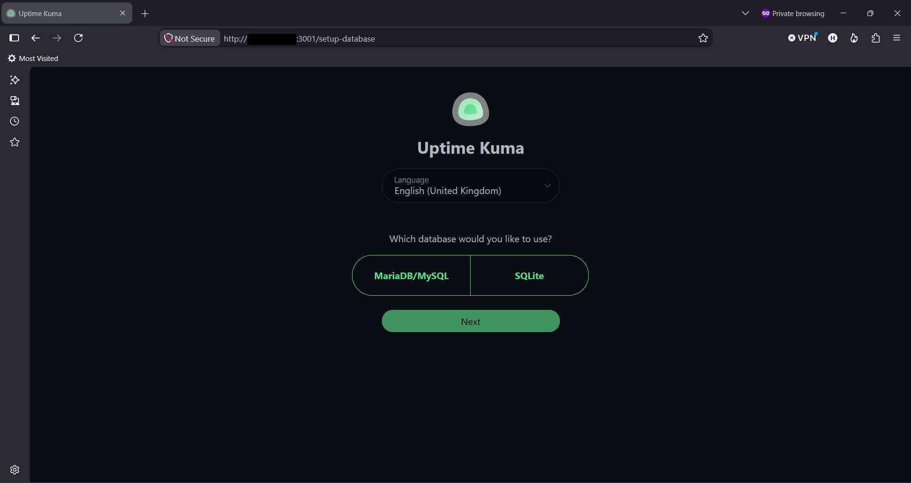
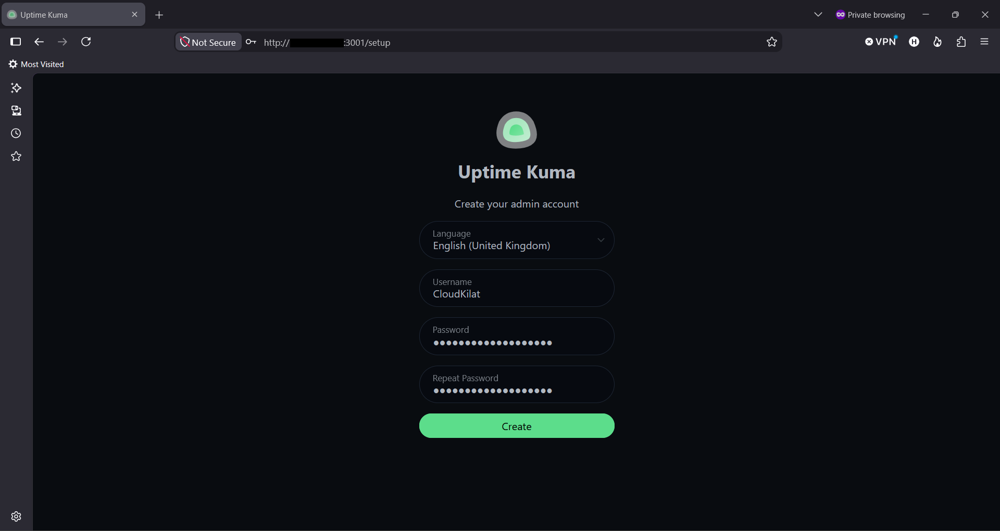
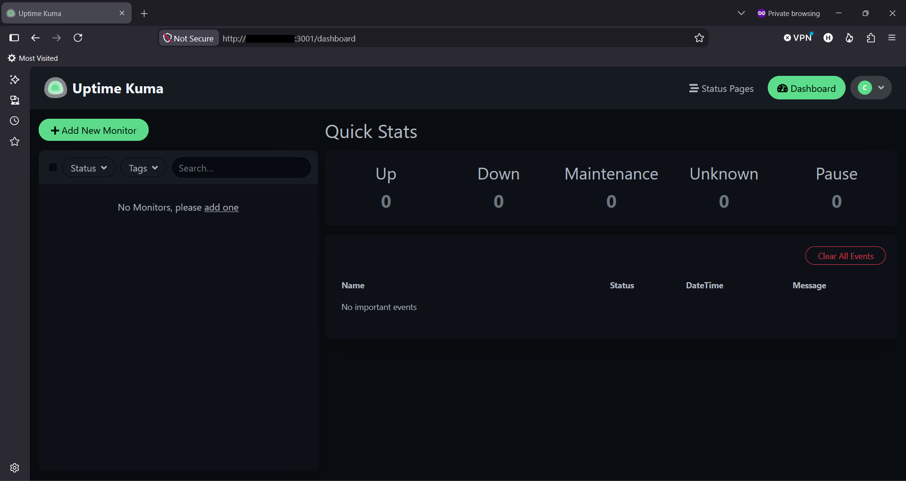

# Cara Instalasi Uptime Kuma di Linux dengan NPM (Non-Docker/Native)

Halo, Kawan Belajar! Artikel ini membahas cara instalasi **Uptime Kuma** pada server Linux menggunakan metode **Non-Docker (Native)** dengan Node.js dan PM2, mulai dari persiapan, konfigurasi PM2, pilihan database (termasuk MariaDB eksternal), hingga berhasil login dan sampai ke halaman utama dashboard.

> **Catatan:** Belum tahu apa itu Uptime Kuma? Baca dulu artikel [Apa Itu Uptime Kuma? Mengenal Tool Monitoring Uptime Self-Hosted](https://kb.cloudkilat.id/uptime-kuma/apa-itu-uptime-kuma-mengenal-tool-monitoring-uptime-self-hosted). Apabila ingin instalasi menggunakan Docker, lihat artikel [Cara Instalasi Uptime Kuma di Linux dengan Docker](https://kb.cloudkilat.id/uptime-kuma/cara-instalasi-uptime-kuma-di-linux-dengan-docker).

## Persiapan Awal

Sebelum memulai instalasi Uptime Kuma, pastikan kamu sudah memiliki:

1. **VPS** dengan sistem operasi Ubuntu 24.04 LTS (atau distribusi Linux lain, lihat bagian [Kompatibilitas Sistem Operasi](#kompatibilitas-sistem-operasi)).
2. Akses **Root** atau user dengan hak akses `sudo`.
3. **IP Address publik** pada VPS.
4. Spesifikasi minimum: 1 vCPU, 1 GB RAM, 10 GB storage. Sudah cukup untuk kebutuhan 20-50 monitor.
5. Port `22/tcp` (SSH) dan `3001/tcp` (akses dashboard Uptime Kuma) dapat diakses dari internet.

## Kompatibilitas Sistem Operasi

Uptime Kuma dengan metode Non-Docker dapat dijalankan pada berbagai distribusi Linux. Perbedaan utama antar distribusi hanya terletak pada perintah instalasi paket dependency (Node.js, Git), sedangkan langkah instalasi Uptime Kuma itu sendiri tetap sama.

| Distribusi                        | Package Manager | Catatan                                                              |
| ---------------------------------- | ---------------- | ---------------------------------------------------------------------- |
| Ubuntu / Debian                    | `apt`            | Digunakan pada panduan ini.                                            |
| CentOS / Rocky Linux / AlmaLinux   | `dnf` / `yum`    | Nama paket dependency seperti `nodejs` dan `git` umumnya tersedia langsung di repository, namun beberapa paket tambahan mungkin memerlukan repository EPEL. |

## Rangkuman Versi yang Digunakan

Panduan ini menggunakan konfigurasi berikut:

| Komponen        | Versi                          |
| ---------------- | ------------------------------- |
| Sistem Operasi   | Ubuntu 24.04 LTS                |
| Uptime Kuma      | 2.5.4 (Git tag)                 |
| Node.js          | 20.x LTS                        |

> **Catatan:** Requirement resmi Node.js untuk metode Non-Docker adalah versi 20.4 ke atas.

---

## 1. Update Sistem

Sebelum melakukan instalasi Uptime Kuma, lakukan update package pada Ubuntu dengan menjalankan perintah berikut:

```bash
apt update && apt upgrade -y
```

---

## 2. Install Node.js dan Git

Install Node.js LTS:

```bash
curl -fsSL https://deb.nodesource.com/setup_lts.x | sudo -E bash -
apt install -y nodejs
```

Install Git:

```bash
apt install -y git
```

Verifikasi instalasi:

```bash
node -v
git --version
```

<p align="center">

  <br>
  <em>Gambar 1: Verifikasi Versi Node dan Git</em>
</p>

Pastikan versi Node.js yang terinstal minimal **20.4**, sesuai requirement resmi Uptime Kuma.

---

## 3. Clone Repository Uptime Kuma

```bash
cd /home
git clone https://github.com/louislam/uptime-kuma.git
cd uptime-kuma
```

Catat direktori instalasi (`/home/uptime-kuma`) karena akan digunakan pada konfigurasi PM2.

---

## 4. Jalankan Setup Uptime Kuma

```bash
npm run setup
```

<p align="center">

  <br>
  <em>Gambar 2: Menjalankan npm run setup</em>
</p>

Command ini menginstall seluruh dependency backend dan frontend serta melakukan build awal aplikasi. Proses ini dapat memakan waktu beberapa menit tergantung spesifikasi VPS.

---

## 5. Install dan Konfigurasi PM2

Install PM2 secara global:

```bash
npm install pm2 -g
```

(Opsional, direkomendasikan) Install modul log rotation agar log PM2 tidak membengkak:

```bash
pm2 install pm2-logrotate
```

### 5.1 Menjalankan Service Uptime Kuma (PM2)

Jalankan Uptime Kuma dengan PM2:

```bash
pm2 start server/server.js --name uptime-kuma
```

Verifikasi status process:

```bash
pm2 list
```

<p align="center">

  <br>
  <em>Gambar 3: Menjalankan pm2 list</em>
</p>

Status harus menunjukkan `online` pada proses `uptime-kuma`.

Aktifkan PM2 agar Uptime Kuma otomatis berjalan kembali saat server reboot:

```bash
pm2 startup
```

Jalankan command yang di-output oleh `pm2 startup` (biasanya berupa `systemctl enable pm2-<user>` atau setara), lalu simpan process list saat ini:

```bash
pm2 save
```

### 5.2 Menghentikan dan Mengelola Service Uptime Kuma (PM2)

Beberapa command PM2 yang berguna untuk mengelola service Uptime Kuma:

```bash
# Menghentikan service
pm2 stop uptime-kuma

# Menjalankan kembali service yang sudah dihentikan
pm2 start uptime-kuma

# Merestart service
pm2 restart uptime-kuma

# Menghapus service dari daftar PM2
pm2 delete uptime-kuma

# Melihat log secara realtime
pm2 logs uptime-kuma

# Melihat console output secara langsung
pm2 monit
```

### 5.3 Update Uptime Kuma

Untuk melakukan update Uptime Kuma pada instalasi Non-Docker, masuk ke direktori instalasi kemudian ambil release terbaru menggunakan Git:

```
cd /home/uptime-kuma
git fetch --all --tags
git checkout <VERSI_TERBARU> --force
npm install --omit dev --no-audit
npm run download-dist
pm2 restart uptime-kuma
```

Ganti `<VERSI_TERBARU>` dengan nomor release yang ingin digunakan, misalnya `2.5.4`. Nomor versi dapat dilihat pada [halaman Releases resmi Uptime Kuma](https://github.com/louislam/uptime-kuma/releases).

Setelah proses update selesai, versi Uptime Kuma dapat diperiksa dengan:

```bash
git describe --tags --exact-match HEAD
```

> **Catatan:** Disarankan untuk melakukan backup data Uptime Kuma sebelum melakukan update, terutama jika instance sudah memiliki banyak konfigurasi monitor, notifikasi, dan Status Page.

---

## 6. Pilihan Database

Pada halaman setup wizard (dibahas di bagian [Akses Website dan Setup Database dengan Akun Admin](#7-akses-website-dan-setup-database-dengan-akun-admin)), Uptime Kuma metode Non-Docker menyediakan dua pilihan database: **SQLite** dan **MariaDB/MySQL**. Embedded MariaDB tidak tersedia pada metode ini karena fitur tersebut hanya dibundel pada Docker image full.

| Pilihan | Keterangan |
| --- | --- |
| **SQLite** | Database disimpan sebagai file di dalam folder instalasi Uptime Kuma. Tidak perlu instalasi database server maupun pembuatan database/user manual. Direkomendasikan untuk kebanyakan kasus dan deployment berskala kecil. |
| **MariaDB/MySQL** | Menghubungkan Uptime Kuma ke database MariaDB yang terpisah. Database, user, dan privilege harus disiapkan lebih dulu oleh administrator, lalu kredensialnya diisi pada wizard. Digunakan apabila membutuhkan performa query lebih tinggi pada jumlah monitor besar. |

Bagian berikut menjelaskan langkah menghubungkan Uptime Kuma ke **MariaDB/MySQL**. Lewati bagian ini apabila menggunakan SQLite.

### 6.1 (Opsional/Advanced) Menghubungkan ke MariaDB/MySQL Eksternal

Karena metode Non-Docker berjalan langsung pada sistem operasi, MariaDB dapat diinstal pada server yang sama tanpa konfigurasi jaringan tambahan seperti pada metode Docker. Database dan user harus dibuat khusus untuk Uptime Kuma, terpisah dari database aplikasi/website lain, karena form setup Uptime Kuma hanya melakukan koneksi ke database yang sudah ada dan tidak membuatnya secara otomatis.

Install MariaDB:

```bash
apt install mariadb-server -y
systemctl enable --now mariadb
```

(Opsional, direkomendasikan) Hardening instalasi:

```bash
mysql_secure_installation
```

Login ke MariaDB:

```bash
mariadb -u root -p
```

Buat database, user dedicated, dan privilege:

```sql
CREATE DATABASE kuma;
CREATE USER 'kuma_user'@'localhost' IDENTIFIED BY 'PASSWORD_KUAT';
GRANT ALL PRIVILEGES ON kuma.* TO 'kuma_user'@'localhost';
FLUSH PRIVILEGES;
EXIT;
```

Kredensial di atas (`localhost`, `kuma_user`, `kuma`) akan dimasukkan pada halaman setup database di bagian selanjutnya.

> **Catatan:** Karena MariaDB dan Uptime Kuma berada pada server yang sama (satu sistem operasi, bukan container terpisah), SSL/TLS pada koneksi database tidak perlu diaktifkan karena traffic tidak melewati jaringan (loopback). SSL/TLS baru relevan apabila MariaDB berada pada server terpisah atau menggunakan layanan database cloud yang mewajibkannya.

Apabila MariaDB berada pada server terpisah dari VPS Uptime Kuma, gunakan IP Address atau hostname server MariaDB tersebut sebagai Hostname pada wizard (bukan `localhost`), dan pastikan port `3306` dapat diakses dari VPS Uptime Kuma melalui firewall serta `bind-address` pada konfigurasi MariaDB sudah diizinkan menerima koneksi dari luar `localhost`.

---

## 7. Akses Website dan Setup Database dengan Akun Admin

Akses Uptime Kuma melalui `http://IP_VPS:3001` pada browser, ganti `IP_VPS` dengan IP Address publik VPS yang digunakan.

<p align="center">

  <br>
  <em>Gambar 4: Halaman Awal Setup Wizard Uptime Kuma Saat Pertama Kali Diakses</em>
</p>

Pilih tipe database sesuai yang tersedia pada wizard (lihat kembali bagian [Pilihan Database](#6-pilihan-database) untuk penjelasan masing-masing opsi):

* **SQLite**: tidak perlu input tambahan, langsung klik Next. Direkomendasikan untuk kebanyakan kasus.
* **MariaDB/MySQL**: isi Hostname (`localhost` apabila satu server dengan MariaDB, atau IP server terpisah), Port (`3306`), Username, Password, dan Database Name sesuai yang dibuat pada langkah 6.1.

<p align="center">

  <br>
  <em>Gambar 5: Pemilihan Database MariaDB/MySQL</em>
</p>

<p align="center">

  <br>
  <em>Gambar 6: Pemilihan Database SQLite</em>
</p>

Buat akun admin dengan username dan password yang kuat pada langkah berikutnya.

<p align="center">

  <br>
  <em>Gambar 7: Setup Admin</em>
</p>

Setelah berhasil, dashboard akan menampilkan Quick Stats kosong (Up/Down/Maintenance/Unknown/Pause semuanya 0) dengan pesan "No Monitors, please add one". Ini adalah kondisi normal karena Uptime Kuma tidak melakukan auto-discovery terhadap layanan apapun; setiap monitor harus ditambahkan manual.

<p align="center">

  <br>
  <em>Gambar 8: Halaman Dashboard</em>
</p>

> **Catatan:** Penambahan monitor, notifikasi, dan status page dibahas pada artikel terpisah.

---

## Troubleshooting

### Service Uptime Kuma Tidak Dapat Diakses

Periksa status process PM2:

```bash
pm2 list
pm2 logs uptime-kuma
```

Pastikan proses dalam kondisi berjalan (`online`).

### Gagal Terhubung ke Database MariaDB/MySQL saat Setup Wizard

Apabila koneksi ke database gagal pada halaman setup wizard, periksa hal berikut:

1. Pastikan service MariaDB dalam kondisi aktif: `systemctl status mariadb`.
2. Pastikan Hostname sesuai konteks instalasi: `localhost` apabila satu server, atau IP server terpisah apabila MariaDB berada pada VPS lain.
3. Pastikan user dan privilege sudah dibuat sesuai langkah 6.1, dan Database Name pada wizard sama persis dengan nama database yang dibuat (`kuma`).
4. Pastikan port `3306` dapat diakses dari proses Uptime Kuma, terutama apabila MariaDB berada pada server terpisah.

## Kesimpulan

Uptime Kuma dapat diinstal pada Linux menggunakan metode Non-Docker (Native) dengan Node.js dan PM2, mendukung dua pilihan database (SQLite dan MariaDB/MySQL eksternal) sesuai skala penggunaan.

Dengan mengikuti panduan ini, Uptime Kuma telah berhasil diinstal, akun admin telah dibuat, dan dashboard utama sudah dapat diakses. Konfigurasi penambahan monitor, notifikasi, dan status page dibahas pada artikel terpisah.

## Referensi

- [Uptime Kuma Official Repository](https://github.com/louislam/uptime-kuma/)
- [Uptime Kuma - How to Install](https://uptimekuma.co/install-uptime-kuma-linux/)
