# Cara Instalasi dan Konfigurasi Uptime Kuma di Sistem Operasi Linux

Halo, Kawan Belajar! Ingin memantau status uptime website atau service milikmu secara mandiri tanpa bergantung pada layanan pihak ketiga?

Pada panduan ini, kita akan membahas cara menginstal dan mengonfigurasi **Uptime Kuma** pada server Linux hingga dapat diakses secara aman melalui domain (HTTPS) menggunakan reverse proxy Nginx dan SSL Certbot.

## Apa Itu Uptime Kuma?

Uptime Kuma merupakan **self-hosted monitoring tool** open source yang digunakan untuk memantau status uptime dari website, server, maupun service lain seperti HTTP(s), TCP, Ping, DNS Record, hingga Docker container. Uptime Kuma menyediakan dashboard interaktif berbasis WebSocket sehingga status monitor dapat diperbarui secara realtime tanpa perlu me-refresh halaman.

Uptime Kuma cocok digunakan pada server Linux ketika pengguna membutuhkan monitoring uptime yang ringan, dapat dihost sendiri, dan tidak bergantung pada kuota atau plan dari layanan monitoring pihak ketiga.

### Kelebihan Uptime Kuma

Beberapa kelebihan Uptime Kuma antara lain:

* **Self-hosted**, sehingga data monitoring sepenuhnya berada di bawah kendali pengguna.
* **Open source**, sehingga dapat digunakan dan dikembangkan secara bebas.
* **Dashboard interaktif**, dengan update status secara realtime melalui WebSocket.
* **Mendukung berbagai tipe monitor**, seperti HTTP(s), TCP, Ping, DNS Record, Push, dan Docker container.
* **Mendukung banyak notifikasi**, seperti Telegram, Discord, Email (SMTP), Slack, dan puluhan integrasi lainnya.
* **Mendukung Public Status Page**, untuk menampilkan status layanan secara publik.

### Kekurangan Uptime Kuma

Uptime Kuma juga memiliki beberapa hal yang perlu diperhatikan:

* Karena bersifat self-hosted, ketersediaan Uptime Kuma bergantung pada uptime VPS itu sendiri, sehingga sebaiknya di-host terpisah dari layanan yang dipantau.
* Pengelolaan update, backup, dan keamanan dilakukan secara mandiri oleh pengguna.
* Basis data default menggunakan SQLite, yang perlu diperhatikan performanya apabila jumlah monitor sangat besar.

Pada panduan ini, Uptime Kuma akan diinstal dan dikonfigurasi pada VPS dengan sistem operasi Ubuntu 24.04 LTS, dilengkapi reverse proxy Nginx dan SSL Certbot agar dapat diakses secara aman melalui domain.

## Persiapan Awal

Sebelum memulai instalasi dan konfigurasi Uptime Kuma, pastikan kamu sudah memiliki:

1. **VPS** dengan sistem operasi Ubuntu 24.04 LTS (atau distribusi Linux lain, lihat bagian [Kompatibilitas Sistem Operasi](#kompatibilitas-sistem-operasi)).
2. Akses **Root** atau user dengan hak akses `sudo`.
3. **IP Address publik** pada VPS.
4. Domain yang A record-nya sudah diarahkan ke IP Address publik VPS (apabila Uptime Kuma akan diakses melalui domain).
5. Spesifikasi minimum: 1 vCPU, 1 GB RAM, 10 GB storage. Sudah cukup untuk kebutuhan 20-50 monitor.
6. Port `22`, `80`, dan `443` dapat diakses dari internet (port `3001` tidak perlu dibuka ke publik, lihat bagian [Konfigurasi Firewall](#5-konfigurasi-firewall-ufw)).

Pada panduan ini, kita akan menggunakan contoh konfigurasi berikut:

| Konfigurasi    | Nilai                       |
| -------------- | ---------------------------- |
| Sistem Operasi | Ubuntu 24.04 LTS             |
| Domain         | `uptime-kuma.domainkamu.com`      |

> **Catatan:** `uptime-kuma.domainkamu.com` hanya digunakan sebagai contoh. Silakan sesuaikan dengan domain yang digunakan.

## Rangkuman Versi yang Digunakan

Panduan ini menggunakan konfigurasi berikut:

| Komponen        | Versi                          |
| ---------------- | ------------------------------- |
| Sistem Operasi   | Ubuntu 24.04 LTS                |
| Uptime Kuma (Non-Docker) | 2.5.4 (Git tag)          |
| Uptime Kuma (Docker)     | Image `louislam/uptime-kuma:2` |
| Node.js          | 20.x LTS (metode Non-Docker)    |
| Nginx            | Repository default Ubuntu 24.04 |
| Certbot          | Plugin `python3-certbot-nginx`  |

> **Catatan:** Tag Docker `:2` **bukan** berarti versi 2.0, melainkan *major-version tag* yang selalu mengikuti rilis stabil terbaru dari seri v2 (`2.x.x`). Pada saat panduan ini ditulis, tag `:2` mengarah ke rilis **2.5.4**. Untuk pin ke versi tertentu, gunakan tag spesifik seperti `2.5.4`. Requirement resmi Node.js untuk metode Non-Docker adalah versi 20.4 ke atas. Cara memeriksa versi aktual yang berjalan dibahas pada bagian [Memeriksa Versi Uptime Kuma yang Berjalan](#9-memeriksa-versi-uptime-kuma-yang-berjalan)

## Kompatibilitas Sistem Operasi

Uptime Kuma dapat dijalankan pada berbagai distribusi Linux, baik menggunakan metode **Docker** maupun **Non-Docker (Native)**. Perbedaan utama antar distribusi hanya terletak pada perintah instalasi paket dependency (Node.js, Git, Docker, Nginx), sedangkan langkah instalasi Uptime Kuma itu sendiri tetap sama.

| Distribusi                        | Package Manager | Catatan                                                              |
| ---------------------------------- | ---------------- | ---------------------------------------------------------------------- |
| Ubuntu / Debian                    | `apt`            | Digunakan pada panduan ini.                                            |
| CentOS / Rocky Linux / AlmaLinux   | `dnf` / `yum`    | Nama paket dapat berbeda, contoh: `nginx`, `certbot`, `python3-certbot-nginx` umumnya tersedia di repository EPEL. |

## Memilih Metode Instalasi

Uptime Kuma dapat diinstal menggunakan salah satu dari dua metode berikut. Pilih salah satu sesuai kebutuhan:

* **Metode Non-Docker (Native)**, menggunakan Node.js dan PM2. Cocok apabila VPS tidak menjalankan Docker atau ingin instalasi langsung pada sistem operasi.
* **Metode Docker**, menggunakan Docker Compose. Cocok apabila VPS sudah menjalankan Docker Engine, karena instalasi menjadi lebih ringkas dan proses update lebih sederhana.


---

## 1. Update Sistem

Sebelum melakukan instalasi Uptime Kuma, lakukan update package pada Ubuntu dengan menjalankan perintah berikut:

```bash
apt update && apt upgrade -y
```

---

## 2. Metode Instalasi A: Non-Docker (Native)

Metode ini menjalankan Uptime Kuma langsung pada sistem operasi menggunakan Node.js dan dikelola oleh process manager PM2.

### 2.1 Install Node.js dan Git

Install Node.js LTS:

```bash
curl -fsSL https://deb.nodesource.com/setup_lts.x | sudo -E bash -
apt install -y nodejs
```

Install Git:

```bash
apt install -y git
```

Verifikasi instalasi:

```bash
node -v
git --version
```

<p align="center">
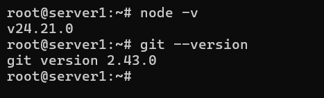
  <br>
  <em>Gambar 1: Verifikasi Versi Node dan Git</em>
</p>

Pastikan versi Node.js yang terinstal minimal **20.4**, sesuai requirement resmi Uptime Kuma.

### 2.2 Clone Repository Uptime Kuma

```bash
cd /home
git clone https://github.com/louislam/uptime-kuma.git
cd uptime-kuma
```

Catat direktori instalasi (`/home/uptime-kuma`) karena akan digunakan pada konfigurasi PM2, Nginx, dan proses update.

### 2.3 Jalankan Setup Uptime Kuma

```bash
npm run setup
```

<p align="center">
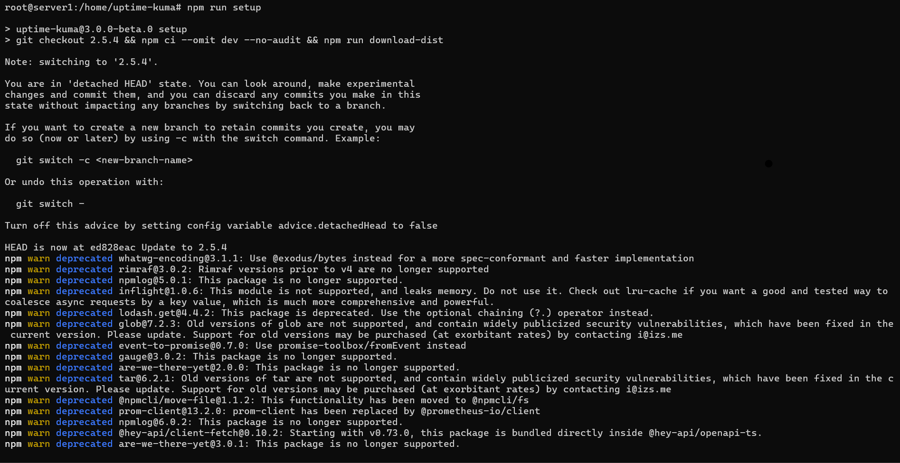
  <br>
  <em>Gambar 2: Menjalankan npm run setup</em>
</p>

Command ini menginstall seluruh dependency backend dan frontend serta melakukan build awal aplikasi. Proses ini dapat memakan waktu beberapa menit tergantung spesifikasi VPS.

### 2.4 Install dan Konfigurasi PM2

Install PM2 secara global:

```bash
npm install pm2 -g
```

(Opsional, direkomendasikan) Install modul log rotation agar log PM2 tidak membengkak:

```bash
pm2 install pm2-logrotate
```

### 2.5 Menjalankan Service Uptime Kuma (PM2)

Jalankan Uptime Kuma dengan PM2:

```bash
pm2 start server/server.js --name uptime-kuma
```

Verifikasi status process:

```bash
pm2 list
```

<p align="center">
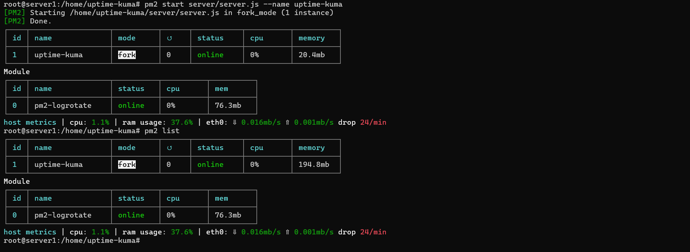
  <br>
  <em>Gambar 3: Menjalankan pm2 list</em>
</p>

Status harus menunjukkan `online` pada proses `uptime-kuma`.

Aktifkan PM2 agar Uptime Kuma otomatis berjalan kembali saat server reboot:

```bash
pm2 startup
```

Jalankan command yang di-output oleh `pm2 startup` (biasanya berupa `systemctl enable pm2-<user>` atau setara), lalu simpan process list saat ini:

```bash
pm2 save
```

### 2.6 Menghentikan dan Mengelola Service Uptime Kuma (PM2)

Beberapa command PM2 yang berguna untuk mengelola service Uptime Kuma:

```bash
# Menghentikan service
pm2 stop uptime-kuma

# Menjalankan kembali service yang sudah dihentikan
pm2 start uptime-kuma

# Merestart service
pm2 restart uptime-kuma

# Menghapus service dari daftar PM2
pm2 delete uptime-kuma

# Melihat log secara realtime
pm2 logs uptime-kuma

# Melihat console output secara langsung
pm2 monit
```

Lanjutkan ke bagian **Pilihan Database** untuk memahami opsi database yang tersedia (Non-Docker hanya menyediakan MariaDB/MySQL dan SQLite), lalu ke bagian **Konfigurasi Firewall**.

---

## 3. Metode Instalasi B: Docker

Metode ini menjalankan Uptime Kuma di dalam container menggunakan image resmi dari Docker Hub.

### 3.1 Install Docker Engine

Apabila Docker belum terinstal pada VPS, install menggunakan script resmi Docker:

```bash
curl -fsSL https://get.docker.com -o get-docker.sh
sh get-docker.sh
```

Verifikasi instalasi Docker dan Docker Compose plugin:

```bash
docker -v
docker compose version
```

<p align="center">
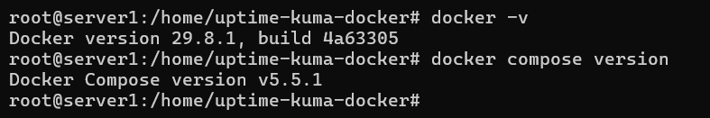
  <br>
  <em>Gambar 4: Verifikasi Versi Docker dan Docker Compose</em>
</p>

> **Catatan:** Apabila Docker sudah terinstal sebelumnya pada VPS, langkah ini dapat dilewati.

### 3.2 Membuat Direktori dan File Compose

Buat direktori kerja untuk Uptime Kuma:

```bash
mkdir -p /home/uptime-kuma-docker
cd /home/uptime-kuma-docker
```

Download `compose.yaml` resmi dari repository Uptime Kuma:

```bash
curl -o compose.yaml https://raw.githubusercontent.com/louislam/uptime-kuma/master/compose.yaml
```

Isi default file `compose.yaml` adalah sebagai berikut:

```yaml
services:
  uptime-kuma:
    image: louislam/uptime-kuma:2
    restart: unless-stopped
    volumes:
      - ./data:/app/data
    ports:
      # <Host Port>:<Container Port>
      - "3001:3001"
```

> **Catatan:** Volume `./data:/app/data` wajib mengarah ke direktori lokal atau Docker volume, bukan ke filesystem jaringan seperti NFS, karena SQLite membutuhkan dukungan POSIX file lock agar tidak terjadi database corruption.

Apabila ingin mengganti port host, sesuaikan bagian `ports` sesuai kebutuhan, misalnya `"8080:3001"`.

### 3.3 Menjalankan Service Uptime Kuma (Docker Compose)

Jalankan container menggunakan Docker Compose:

```bash
docker compose up -d
```

<p align="center">

  <br>
  <em>Gambar 5: Menjalankan docker compose up -d</em>
</p>

Verifikasi container berjalan:

```bash
docker ps
```

<p align="center">
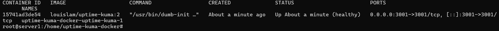
  <br>
  <em>Gambar 6: Menjalankan docker ps</em>
</p>

Status container harus menunjukkan kondisi `Up`.

### 3.4 Menghentikan dan Mengelola Service Uptime Kuma (Docker Compose)

Beberapa command Docker Compose yang berguna untuk mengelola service Uptime Kuma:

```bash
# Menghentikan container tanpa menghapusnya
docker compose stop

# Menjalankan kembali container yang sudah dihentikan
docker compose start

# Merestart container
docker compose restart

# Menghentikan dan menghapus container (data pada volume tetap aman)
docker compose down

# Melihat log container secara realtime
docker compose logs -f
```

Restart otomatis saat reboot server sudah tertangani oleh nilai `restart: unless-stopped` pada `compose.yaml`, sehingga tidak diperlukan konfigurasi tambahan seperti `pm2 startup` pada metode Non-Docker.

---

## 4. Pilihan Database

Pada halaman setup wizard (dibahas di langkah 7), Uptime Kuma menyediakan pilihan database. Jumlah pilihan berbeda tergantung metode instalasi:

* **Non-Docker (Native)**: hanya tersedia **MariaDB/MySQL** dan **SQLite**. 
* **Docker (image full, tag `2`)**: tersedia tiga pilihan — **Embedded MariaDB**, **MariaDB/MySQL**, dan **SQLite**.

| Pilihan | Keterangan |
| --- | --- |
| **SQLite** | Database disimpan sebagai file di dalam direktori data (`/app/data` pada Docker, atau folder instalasi pada Non-Docker). Tidak perlu instalasi database server maupun pembuatan database/user manual. Direkomendasikan untuk kebanyakan kasus dan deployment berskala kecil. |
| **Embedded MariaDB** *(khusus instalasi dengan Docker)* | MariaDB sudah dibundel dan dikonfigurasi otomatis oleh image, diakses melalui Unix socket. Tidak perlu `apt install mariadb-server` maupun `CREATE DATABASE`/`CREATE USER` manual — cukup pilih opsi ini pada wizard. |
| **MariaDB/MySQL** | Menghubungkan Uptime Kuma ke database MariaDB yang terpisah. Database, user, dan privilege harus disiapkan lebih dulu oleh administrator, lalu kredensialnya diisi pada wizard. Digunakan apabila membutuhkan database terpisah dari container/instalasi, misalnya untuk performa query lebih tinggi pada jumlah monitor besar. |

> **Catatan:** Meskipun memilih Embedded MariaDB, volume `./data:/app/data` pada `compose.yaml` tetap wajib dipetakan ke direktori lokal atau Docker volume, karena data MariaDB tersebut tetap disimpan di dalam path tersebut. Menghapus container tanpa persistent volume akan menghilangkan seluruh data.

Bagian berikut menjelaskan langkah setup **MariaDB/MySQL** apabila opsi tersebut dipilih. Lewati bagian ini apabila menggunakan SQLite atau Embedded MariaDB.

### 4.1 (Opsional/Advanced) Setup Database Eksternal MariaDB/MySQL

Jika menggunakan MariaDB/MySQL eksternal, database dan user harus dibuat khusus untuk Uptime Kuma, terpisah dari database aplikasi/website lain, karena form setup Uptime Kuma hanya melakukan koneksi ke database yang sudah ada dan tidak membuatnya secara otomatis.

Install MariaDB (pada VPS yang sama dengan instalasi Non-Docker; apabila menggunakan Docker, MariaDB dapat dijalankan sebagai container atau service terpisah):

```bash
apt install mariadb-server -y
systemctl enable --now mariadb
```

(Opsional, direkomendasikan) Hardening instalasi:

```bash
mysql_secure_installation
```

Login ke MariaDB:

```bash
mariadb -u root -p
```

Buat database, user dedicated, dan privilege:

```sql
CREATE DATABASE kuma;
CREATE USER 'kuma_user'@'localhost' IDENTIFIED BY 'PASSWORD_KUAT';
GRANT ALL PRIVILEGES ON kuma.* TO 'kuma_user'@'localhost';
FLUSH PRIVILEGES;
EXIT;
```

Kredensial di atas (`localhost`, `kuma_user`, `kuma`) akan dimasukkan pada halaman setup database di langkah 7.

> **Catatan:** Jika MariaDB berada di server yang sama dengan Uptime Kuma, SSL/TLS pada koneksi database tidak perlu diaktifkan karena traffic tidak melewati jaringan (loopback). SSL/TLS baru relevan jika database berada di VPS terpisah atau menggunakan layanan database cloud yang mewajibkannya. Apabila Uptime Kuma dijalankan sebagai Docker container sedangkan MariaDB berada di host, gunakan `host.docker.internal` atau IP internal host sebagai Hostname, bukan `localhost`.

---

## 5. Konfigurasi Firewall (UFW)

Sebelum expose lewat domain, batasi akses langsung ke port `3001` dan hanya buka port yang dibutuhkan reverse proxy:

```bash
ufw allow 22/tcp
ufw allow 80/tcp
ufw allow 443/tcp
ufw reload
ufw status
```

<p align="center">
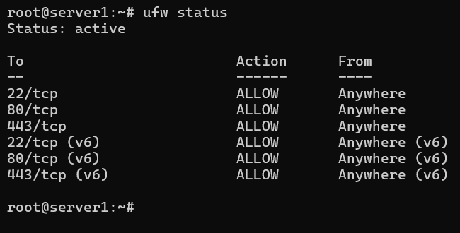
  <br>
  <em>Gambar 7: Verifikasi Konfigurasi UFW</em>
</p>

Port `3001` tidak perlu (dan tidak boleh) dibuka ke publik pada tahap produksi karena seluruh traffic publik akan melewati Nginx di port `80`/`443`.

---

## 6. Reverse Proxy dan SSL

### 6.1 Install dan Konfigurasi Nginx sebagai Reverse Proxy

Install Nginx:

```bash
apt install nginx -y
```

Verifikasi instalasi:

```bash
nginx -v
systemctl status nginx
```

Buat file konfigurasi:

```bash
nano /etc/nginx/conf.d/uptime-kuma.conf
```

Isi dengan konfigurasi berikut, ganti `uptime-kuma.domainkamu.com` dengan domain yang sudah di-pointing ke alamat IP hosting:

```nginx
server {
    listen 80;
    server_name uptime-kuma.domainkamu.com;

    location / {
        proxy_pass         http://127.0.0.1:3001;
        proxy_http_version 1.1;
        proxy_set_header   Upgrade $http_upgrade;
        proxy_set_header   Connection "upgrade";
        proxy_set_header   Host $host;
        proxy_set_header   X-Real-IP $remote_addr;
        proxy_set_header   X-Forwarded-For $proxy_add_x_forwarded_for;
        proxy_set_header   X-Forwarded-Proto $scheme;

        proxy_set_header   Sec-WebSocket-Key $http_sec_websocket_key;
        proxy_set_header   Sec-WebSocket-Version $http_sec_websocket_version;
        proxy_set_header   Sec-WebSocket-Extensions $http_sec_websocket_extensions;

        proxy_buffering    off;
    }
}
```

> **Catatan:** Header `Upgrade` dan `Connection` wajib ada karena Uptime Kuma menggunakan WebSocket untuk update dashboard secara realtime. Tanpa kedua header ini, dashboard akan gagal menerima update status secara live meskipun halaman tetap bisa diakses.

Test konfigurasi dan reload Nginx:

```bash
nginx -t
systemctl reload nginx
```

<p align="center">
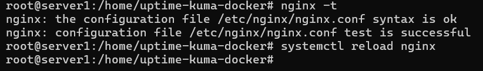
  <br>
  <em>Gambar 8: Verifikasi NGINX</em>
</p>

Pada titik ini Uptime Kuma sudah bisa diakses melalui `http://uptime-kuma.domainkamu.com`, namun masih tanpa enkripsi (HTTP biasa).

### 6.2 Pasang SSL dengan Certbot

Install Certbot beserta plugin Nginx:

```bash
apt install certbot python3-certbot-nginx -y
```

Jalankan Certbot untuk domain yang sama dengan konfigurasi Nginx:

```bash
certbot --nginx -d uptime-kuma.domainkamu.com
```

<p align="center">
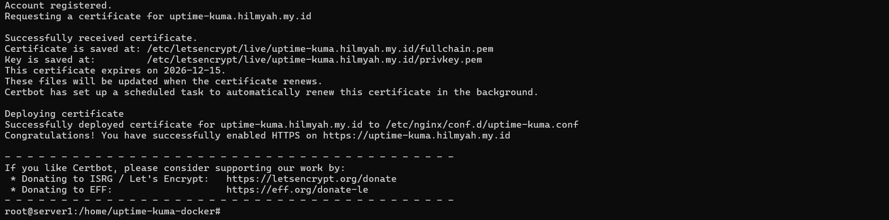
  <br>
  <em>Gambar 9: Sertifikat Berhasil Diterbitkan</em>
</p>

Certbot akan otomatis mengubah konfigurasi Nginx untuk menambahkan blok `listen 443 ssl`, redirect HTTP ke HTTPS, dan menjadwalkan auto-renewal sertifikat.

Verifikasi auto-renewal berjalan dengan benar:

```bash
certbot renew --dry-run
```

<p align="center">
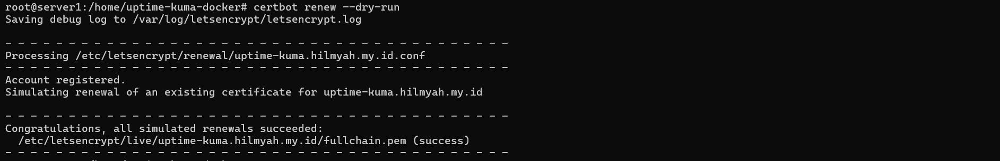
  <br>
  <em>Gambar 10: Verifikasi Auto-Renewal</em>
</p>

---

## 7. Akses Website dan Setup Database dengan Akun Admin

Akses Uptime Kuma melalui `https://uptime-kuma.domainkamu.com` (atau `http://IP_VPS:3001` apabila belum melakukan konfigurasi reverse proxy dan SSL).

<p align="center">

  <br>
  <em>Gambar 11: Halaman Awal Setup Wizard Uptime Kuma Saat Pertama Kali Diakses - Non-Docker (Native)</em>
</p>

<p align="center">
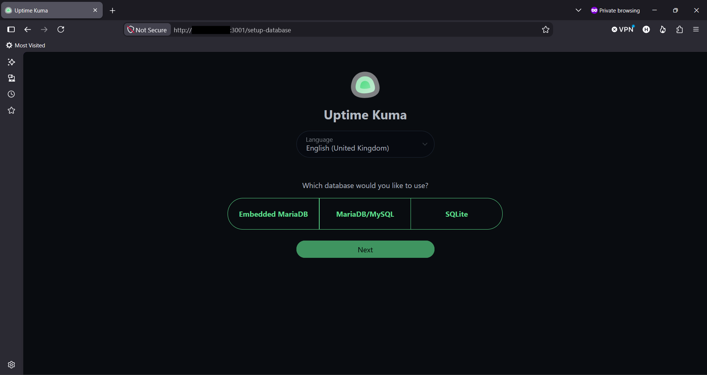
  <br>
  <em>Gambar 12: Halaman Awal Setup Wizard Uptime Kuma Saat Pertama Kali Diakses - Docker</em>
</p>

Pilih tipe database sesuai yang tersedia pada wizard (lihat kembali bagian [Pilihan Database](#4-pilihan-database) untuk penjelasan masing-masing opsi):

* **Embedded MariaDB** *(khusus Docker image full)*: tidak perlu input tambahan, langsung klik Next.
* **SQLite**: tidak perlu input tambahan, langsung klik Next. Direkomendasikan untuk kebanyakan kasus.
* **MariaDB/MySQL**: isi Hostname (`localhost` jika satu server dan Non-Docker, atau IP internal host jika Uptime Kuma dijalankan via Docker), Port (`3306`), Username, Password, dan Database Name sesuai yang dibuat pada langkah 4.1.

<p align="center">
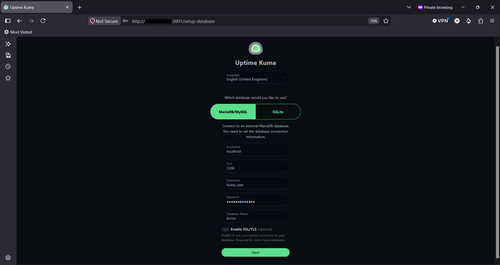
  <br>
  <em>Gambar 13: Pemilihan Database MariaDB/MySQL</em>
</p>

<p align="center">
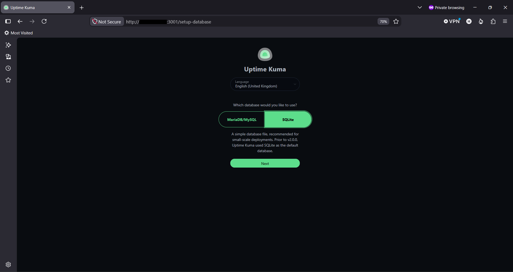
  <br>
  <em>Gambar 14: Pemilihan Database SQLite</em>
</p>

<p align="center">
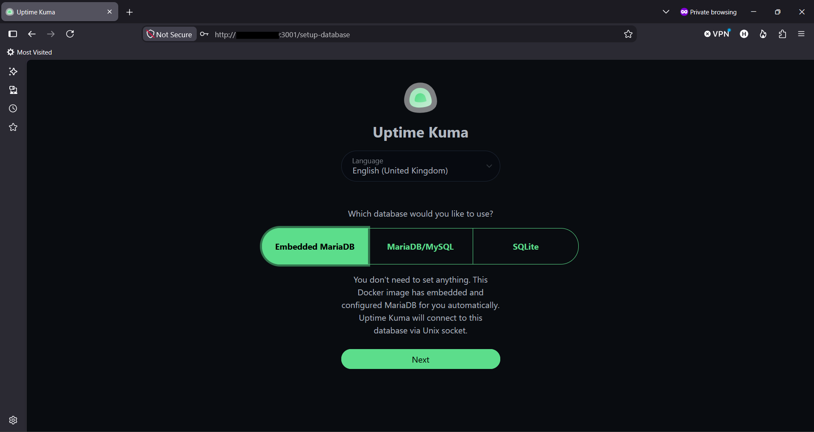
  <br>
  <em>Gambar 15: Pemilihan Database Embedded MariaDB</em>
</p>

Buat akun admin dengan username dan password yang kuat pada langkah berikutnya.

<p align="center">

  <br>
  <em>Gambar 16: Setup Admin</em>
</p>

Setelah berhasil, dashboard akan menampilkan Quick Stats kosong (Up/Down/Maintenance/Unknown/Pause semuanya 0) dengan pesan "No Monitors, please add one". Ini adalah kondisi normal karena Uptime Kuma tidak melakukan auto-discovery terhadap layanan apapun; setiap monitor harus ditambahkan manual.

<p align="center">

  <br>
  <em>Gambar 17: Halaman Dashboard</em>
</p>

> **Catatan:** Penambahan monitor, notifikasi, dan status page dibahas pada artikel terpisah.

---

## 8. Setting Awal dan Verifikasi (Trust Proxy)

Karena Uptime Kuma berada di belakang reverse proxy, IP client asli tidak akan tercatat dengan benar tanpa konfigurasi tambahan. Masuk ke:

```text
Settings > Reverse Proxy
```

<p align="center">
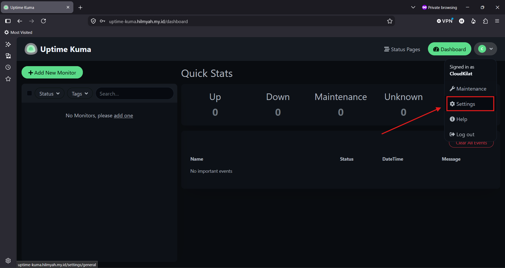
  <br>
  <em>Gambar 18: Settings</em>
</p>

Set **Trust Proxy** menjadi **Yes**. Ini membuat Uptime Kuma membaca IP client dari header `X-Forwarded-For` yang diteruskan Nginx, bukan mencatat IP Nginx itu sendiri sebagai sumber request.

<p align="center">
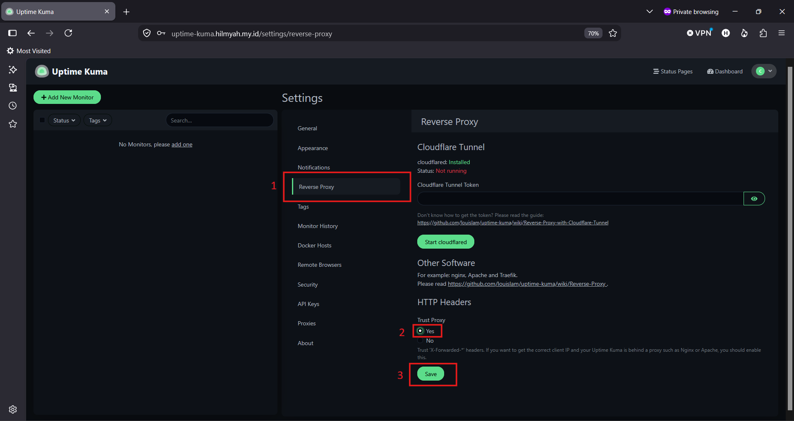
  <br>
  <em>Gambar 19: Reverse Proxy</em>
</p>

### Verifikasi Akhir

Akses `https://uptime-kuma.domainkamu.com` dan pastikan:

* Koneksi menampilkan sertifikat valid (padlock aktif, bukan "Not Secure").
* Login admin berhasil.
* Dashboard menampilkan Quick Stats seperti pada langkah 7.

<p align="center">
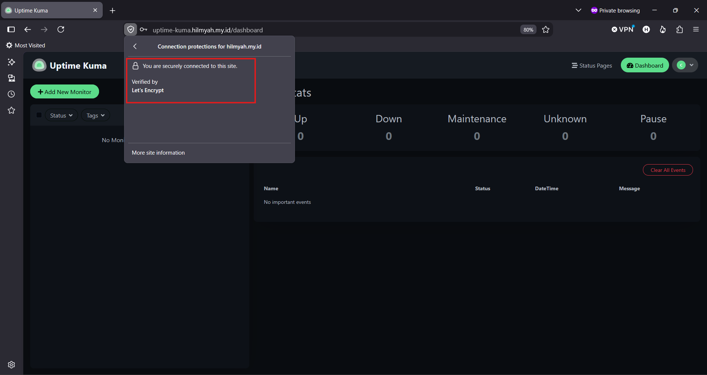
  <br>
  <em>Gambar 20: Connection Secured</em>
</p>

Instalasi, reverse proxy, dan SSL selesai. Konfigurasi monitor, notifikasi, dan status page dilakukan pada artikel terpisah.

---

## 9. Update Uptime Kuma

### Update Metode Non-Docker (Native)

```bash
cd /home/uptime-kuma
git fetch --all --tags
git checkout <VERSI_TERBARU> --force
npm install --omit dev --no-audit
npm run download-dist
pm2 restart uptime-kuma
```

Ganti `<VERSI_TERBARU>` dengan nomor rilis terbaru sesuai [halaman Releases resmi Uptime Kuma](https://github.com/louislam/uptime-kuma/releases), contoh `2.5.4`.

### Update Metode Docker

```bash
cd /home/uptime-kuma-docker
docker compose pull
docker compose up -d --force-recreate
```

Karena image menggunakan tag `:2`, `docker compose pull` akan menarik rilis stabil terbaru dari seri v2 secara otomatis tanpa perlu menuliskan nomor versi secara manual.

> **Catatan:** Jangan mencampur kedua metode update pada environment yang sama. Metode Non-Docker menggunakan `git` dan `pm2` dengan versi mengikuti Git tag yang di-checkout secara eksplisit, sedangkan metode Docker menggunakan `docker compose` dengan versi mengikuti tag image (`:2` untuk rilis terbaru seri v2, atau tag spesifik seperti `2.5.4` apabila ingin pin versi). Pastikan volume/direktori data (`./data` untuk Docker, database SQLite/MariaDB untuk Non-Docker) tetap aman sebelum melakukan update, terutama apabila melakukan downgrade versi.

---

## Troubleshooting

### Dashboard Tidak Menerima Update Status Secara Realtime

Periksa kembali konfigurasi Nginx pada `/etc/nginx/conf.d/uptime-kuma.conf`, pastikan header `Upgrade`, `Connection`, dan seluruh header `Sec-WebSocket-*` sudah ada sesuai langkah 6.1. Jalankan kembali:

```bash
nginx -t
systemctl reload nginx
```

### Service Uptime Kuma Tidak Dapat Diakses

Periksa status service sesuai metode instalasi yang digunakan:

```bash
# Metode Non-Docker
pm2 list
pm2 logs uptime-kuma

# Metode Docker
docker ps
docker compose logs -f
```

Pastikan proses/container dalam kondisi berjalan (`online` pada PM2, atau `Up` pada Docker).

### IP Client Tidak Tercatat dengan Benar pada Monitor/Log

Pastikan opsi **Trust Proxy** pada `Settings > Reverse Proxy` sudah diaktifkan sesuai langkah 8, dan header `X-Forwarded-For` sudah diteruskan oleh Nginx sesuai konfigurasi pada langkah 6.1.

### Sertifikat SSL Gagal Diterbitkan

Pastikan A record domain sudah mengarah ke IP Address publik VPS dan propagasi DNS sudah selesai sebelum menjalankan `certbot --nginx`. Periksa juga port `80` dapat diakses dari internet, karena Certbot menggunakan metode HTTP-01 challenge melalui port tersebut secara default.

## Kesimpulan

Uptime Kuma dapat diinstal pada sistem operasi Linux baik menggunakan metode Non-Docker (Native dengan Node.js dan PM2) maupun metode Docker (Docker Compose), sesuai kebutuhan dan preferensi environment yang digunakan. Dengan konfigurasi reverse proxy Nginx dan SSL Certbot, Uptime Kuma dapat diakses secara aman melalui domain (HTTPS) dengan dashboard yang menerima update status secara realtime melalui WebSocket.

Dengan mengikuti panduan ini, Uptime Kuma telah berhasil diinstal, dikonfigurasi sebagai reverse proxy dengan Trust Proxy aktif, serta siap digunakan untuk menambahkan monitor sesuai kebutuhan.

## Referensi

- [Uptime Kuma Official Repository](https://github.com/louislam/uptime-kuma)
- [Uptime Kuma - How to Install](https://github.com/louislam/uptime-kuma/wiki/%F0%9F%94%A7-How-to-Install)
- [Uptime Kuma - How to Update](https://github.com/louislam/uptime-kuma/wiki/%F0%9F%86%99-How-to-Update)
- [Uptime Kuma - Reverse Proxy](https://github.com/louislam/uptime-kuma/wiki/Reverse-Proxy)
- [Uptime Kuma Releases](https://github.com/louislam/uptime-kuma/releases)