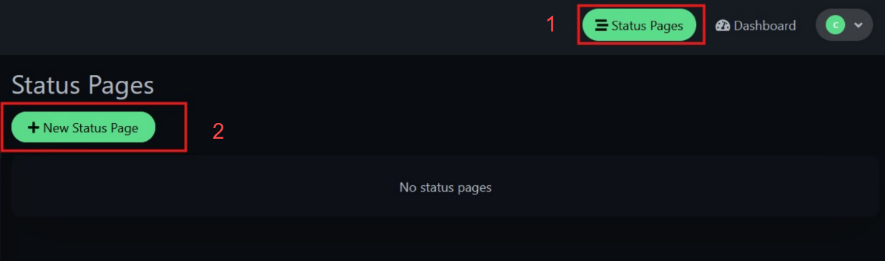
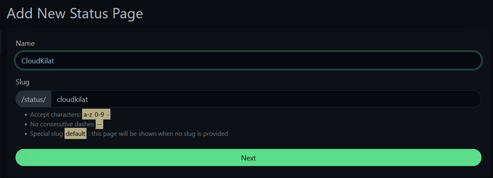
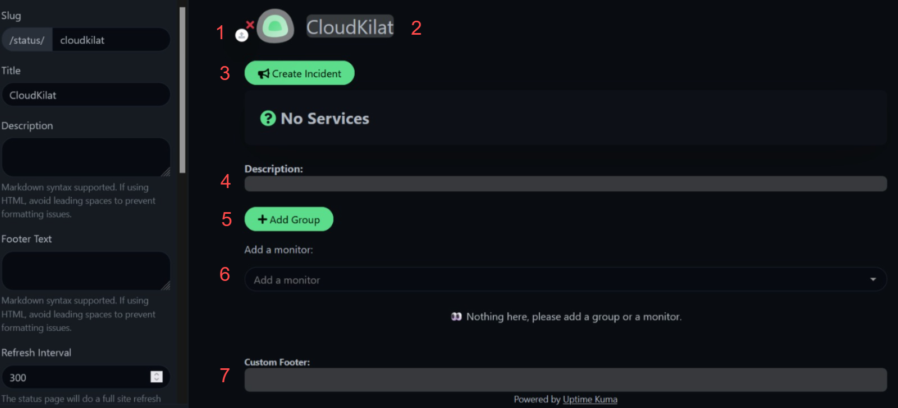
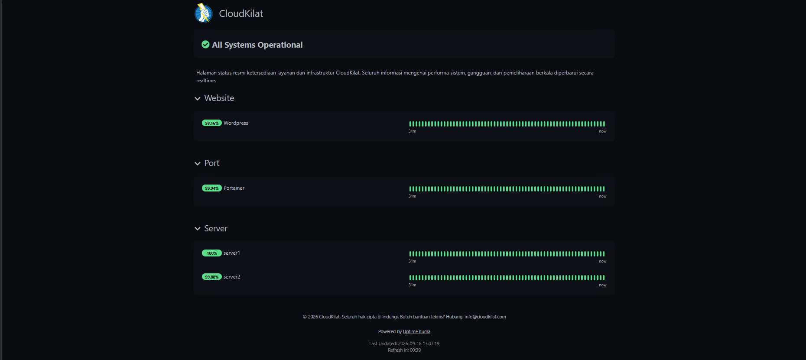
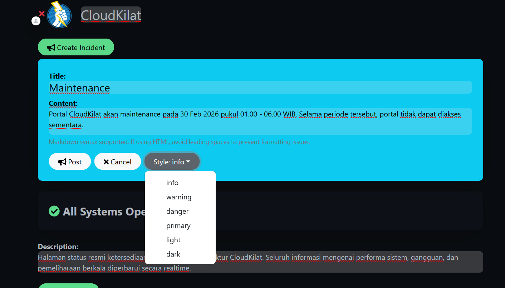
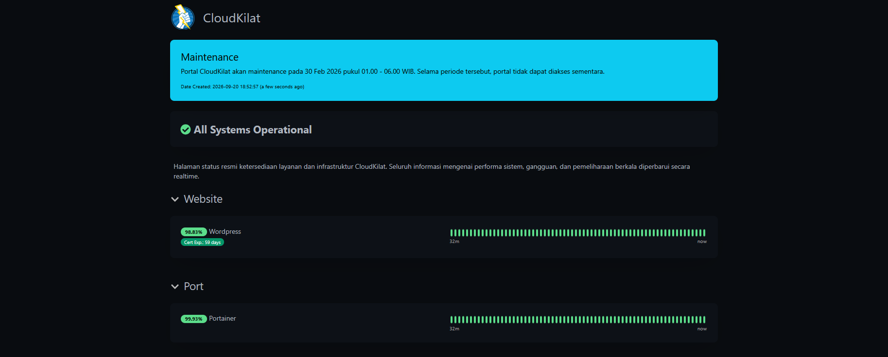
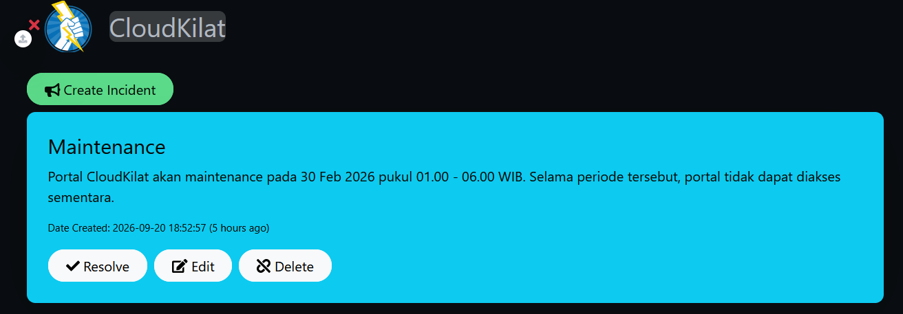
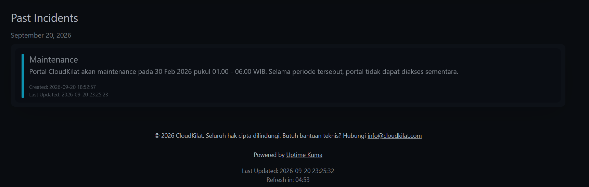

# Cara Membuat Public Status Page di Uptime Kuma

Halo, Kawan Belajar! Dashboard Uptime Kuma hanya dapat diakses setelah login sebagai admin, sehingga status layanan tidak dapat dilihat langsung oleh pengguna atau klien. Untuk kebutuhan tersebut, Uptime Kuma menyediakan fitur **Public Status Page**, yaitu halaman status yang dapat diakses tanpa login dan menampilkan monitor yang dipilih saja.

Pada panduan ini akan dibahas cara membuat status page, mengelompokkan monitor ke dalam beberapa grup, menyesuaikan tampilannya, hingga membuat dan mengakhiri pengumuman gangguan (incident).

> **Catatan:** Panduan ini merupakan lanjutan dari artikel [Cara Menambahkan dan Mengonfigurasi Monitor di Uptime Kuma](https://kb.cloudkilat.id/uptime-kuma/cara-menambahkan-dan-mengonfigurasi-monitor-di-uptime-kuma). Pastikan Uptime Kuma sudah terinstal dan minimal satu monitor sudah ditambahkan sebelum mengikuti langkah-langkah berikut.

## Persiapan Awal

Sebelum memulai, pastikan sudah memiliki:

1. Uptime Kuma yang sudah terinstal dan dapat diakses melalui dashboard, sesuai artikel instalasi sebelumnya.
2. Akun admin Uptime Kuma yang sudah login ke dashboard.
3. Minimal satu monitor yang sudah ditambahkan, karena status page hanya menampilkan monitor yang sudah ada.

---

## 1. Membuka Halaman Status Pages

Pada dashboard Uptime Kuma, klik menu **Status Pages** di bagian kanan atas (1), kemudian klik tombol **New Status Page** (2).

<p align="center">

  <br>
  <em>Gambar 1: Membuka Halaman Status Pages</em>
</p>

Apabila belum pernah membuat status page, halaman akan menampilkan keterangan `No status pages`. Ini adalah kondisi normal.

---

## 2. Menentukan Nama dan Slug Status Page

Pada halaman **Add New Status Page**, isi konfigurasi berikut:

* **Name**: nama status page, contoh `CloudKilat`.
* **Slug**: bagian akhir URL status page, contoh `cloudkilat` sehingga status page dapat diakses pada path `/status/cloudkilat`.

<p align="center">

  <br>
  <em>Gambar 2: Menentukan Nama dan Slug Status Page</em>
</p>

Ketentuan penulisan slug:

* Karakter yang diterima hanya `a-z`, `0-9`, dan tanda hubung (`-`).
* Tidak boleh menggunakan tanda hubung berurutan (`--`).
* Slug khusus `default` akan ditampilkan ketika status page diakses tanpa menyertakan slug.

Klik **Next** untuk melanjutkan ke halaman editor status page.

---

## 3. Mengenal Halaman Editor Status Page

Halaman editor terbagi menjadi dua bagian, yaitu panel pengaturan di sisi kiri dan area preview di sisi kanan yang dapat diedit secara langsung.

<p align="center">

  <br>
  <em>Gambar 3: Halaman Editor Status Page</em>
</p>

Bagian yang dapat dikonfigurasi pada area preview:

1. **Logo**: klik ikon unggah pada logo untuk mengganti gambar yang ditampilkan di bagian atas status page.
2. **Judul**: nama status page yang tampil pada halaman, dapat diedit langsung maupun melalui field **Title** pada panel kiri.
3. **Create Incident**: membuat pengumuman gangguan atau pemeliharaan yang ditampilkan sebagai banner di bagian atas status page, dibahas pada langkah 7.
4. **Description**: deskripsi singkat mengenai status page, mendukung format Markdown.
5. **Add Group**: membuat grup/kategori untuk mengelompokkan monitor, contoh `Website`, `Port`, dan `Server`.
6. **Add a monitor**: dropdown untuk memilih monitor yang akan ditampilkan pada status page.
7. **Custom Footer**: teks footer yang ditampilkan di bagian bawah status page, mendukung format Markdown.

Apabila grup maupun monitor belum ditambahkan, area preview akan menampilkan keterangan `Nothing here, please add a group or a monitor`.

---

## 4. Pengaturan pada Panel Kiri Editor

Panel kiri berisi pengaturan tampilan dan perilaku status page. Seluruh perubahan baru tersimpan setelah tombol **Save** di bagian bawah panel ditekan.

Pengaturan yang tersedia:

* **Slug**: mengubah slug yang sudah dibuat pada langkah sebelumnya.
* **Title**: judul status page.
* **Description**: deskripsi status page, mendukung Markdown.
* **Footer Text**: teks footer status page, mendukung Markdown.
* **Refresh Interval**: jeda refresh otomatis halaman status dalam detik, default `300`.
* **Theme**: tema tampilan status page, yaitu `Auto`, `Light`, atau `Dark`.
* **Show Tags**: menampilkan tag monitor pada status page.
* **Show Powered By**: menampilkan keterangan `Powered by Uptime Kuma` pada bagian bawah halaman.
* **Show Certificate Expiry**: menampilkan sisa masa berlaku sertifikat SSL pada monitor HTTPS, tampil sebagai badge `Cert Exp.` di samping nama monitor.
* **Show Only Last Heartbeat**: menampilkan hanya hasil pengecekan terakhir, tanpa grafik heartbeat.
* **Domain Names**: mendaftarkan domain khusus agar status page dapat diakses langsung melalui domain tersebut, selain melalui path `/status/SLUG` pada alamat instance Uptime Kuma. Konfigurasi reverse proxy dan SSL untuk domain khusus berada di luar cakupan panduan ini.
* **Analytics Type**: integrasi layanan analytics, default `None`.
* **RSS Title**: judul feed RSS status page, dikosongkan untuk mengikuti judul status page.
* **Custom CSS**: CSS tambahan untuk menyesuaikan tampilan status page.

---

## 5. Menambahkan Grup dan Monitor

Monitor pada status page harus berada di dalam sebuah grup, sehingga grup perlu dibuat terlebih dahulu.

1. Klik **Add Group**, lalu ubah nama grup sesuai kebutuhan, contoh `Website`.
2. Pilih monitor yang ingin ditampilkan melalui dropdown **Add a monitor**.
3. Ulangi langkah 1 dan 2 untuk grup lain, contoh grup `Port` untuk monitor TCP Port dan grup `Server` untuk monitor Ping.
4. Klik **Save** pada panel kiri untuk menyimpan status page.

---

## 6. Mengakses Status Page

Setelah disimpan, status page dapat diakses melalui URL berikut tanpa perlu login:

```
http://IP_VPS:3001/status/SLUG
```

Ganti `IP_VPS` dengan IP Address publik VPS Uptime Kuma dan `SLUG` dengan slug yang dibuat pada langkah 2.

<p align="center">

  <br>
  <em>Gambar 4: Tampilan Public Status Page</em>
</p>

Informasi yang ditampilkan pada status page:

* **Banner status keseluruhan**, contoh `All Systems Operational` ketika seluruh monitor berstatus up.
* **Persentase uptime** pada masing-masing monitor.
* **Grafik heartbeat**, berupa bar hijau (up) atau merah (down) pada setiap siklus pengecekan.
* **Last Updated** dan **Refresh in**, sebagai penanda waktu pembaruan data terakhir dan hitung mundur refresh berikutnya sesuai nilai Refresh Interval.

> **Catatan:** Status page bersifat publik dan dapat diakses siapa pun yang mengetahui URL-nya, sehingga sebaiknya gunakan Friendly Name monitor yang tidak memuat informasi sensitif seperti nama host internal.

---

## 7. Membuat Incident pada Status Page

Fitur **Incident** digunakan untuk menyampaikan pengumuman gangguan atau jadwal pemeliharaan kepada pengunjung status page.

Pada halaman editor status page, klik **Create Incident**, lalu isi:

* **Title**: judul pengumuman, contoh `Maintenance`.
* **Content**: isi pengumuman, mendukung format Markdown.
* **Style**: warna banner pengumuman, tersedia pilihan `info`, `warning`, `danger`, `primary`, `light`, dan `dark`.

<p align="center">

  <br>
  <em>Gambar 5: Membuat Incident pada Status Page</em>
</p>

Klik **Post** untuk menayangkan pengumuman, atau **Cancel** untuk membatalkannya. Setelah ditayangkan, banner pengumuman akan tampil di bagian paling atas status page beserta keterangan **Date Created**.

<p align="center">

  <br>
  <em>Gambar 6: Tampilan Incident pada Status Page</em>
</p>

---

## 8. Mengakhiri Incident

Incident yang masih aktif akan terus tampil sebagai banner di bagian atas status page hingga diakhiri secara manual. Pada halaman editor status page, banner incident yang aktif menampilkan tiga tombol aksi: **Resolve**, **Edit**, dan **Delete**.

<p align="center">

  <br>
  <em>Gambar 7: Tombol Resolve, Edit, dan Delete pada Incident</em>
</p>

* **Resolve**: menandai incident sebagai selesai. Banner akan hilang dari bagian atas status page dan dipindahkan ke bagian **Past Incidents**.
* **Edit**: mengubah Title, Content, atau Style pada incident yang sedang aktif.
* **Delete**: menghapus incident secara permanen tanpa memindahkannya ke Past Incidents.

Setelah incident di-Resolve, status page akan menampilkan bagian **Past Incidents** di bagian bawah halaman, berisi riwayat incident beserta tanggal **Created** dan **Last Updated**.

<p align="center">

  <br>
  <em>Gambar 8: Riwayat Incident pada Past Incidents</em>
</p>

> **Catatan:** Incident yang di-Resolve tetap tersimpan pada riwayat Past Incidents dan tidak dapat dikembalikan menjadi banner aktif. Apabila gangguan yang sama terjadi kembali, buat incident baru melalui **Create Incident**.

---

## Troubleshooting

### Monitor Tidak Muncul pada Dropdown Add a monitor

Dropdown hanya menampilkan monitor yang sudah dibuat pada Uptime Kuma. Tambahkan monitor terlebih dahulu sesuai artikel [Cara Menambahkan dan Mengonfigurasi Monitor di Uptime Kuma](https://kb.cloudkilat.id/uptime-kuma/cara-menambahkan-dan-mengonfigurasi-monitor-di-uptime-kuma).

### Incident Sudah di-Resolve, Namun Masih Tampil sebagai Banner

Refresh halaman status page secara manual. Status page melakukan refresh otomatis sesuai nilai **Refresh Interval**, sehingga perubahan tidak selalu langsung terlihat tanpa refresh manual.

## Kesimpulan

Dengan Public Status Page, status layanan pada Uptime Kuma dapat ditampilkan kepada pengguna maupun klien tanpa memberikan akses ke dashboard admin. Monitor dapat dikelompokkan ke dalam beberapa grup sesuai jenis layanan, dilengkapi logo, deskripsi, dan footer khusus, serta pengumuman incident saat terjadi gangguan atau pemeliharaan yang dapat diakhiri (Resolve) sehingga tercatat pada riwayat Past Incidents.

CloudKilat menyediakan layanan Kilat VM dan domain yang dapat digunakan untuk menjalankan Uptime Kuma beserta Public Status Page-nya. Layanan tersebut juga didukung oleh tim support CloudKilat dengan pelayanan selama 7x24 jam apabila mengalami kendala pada konfigurasi.

Terima kasih, sekian dan semoga bermanfaat.

## Referensi

- [Uptime Kuma Official Repository](https://github.com/louislam/uptime-kuma/)