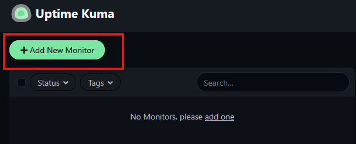
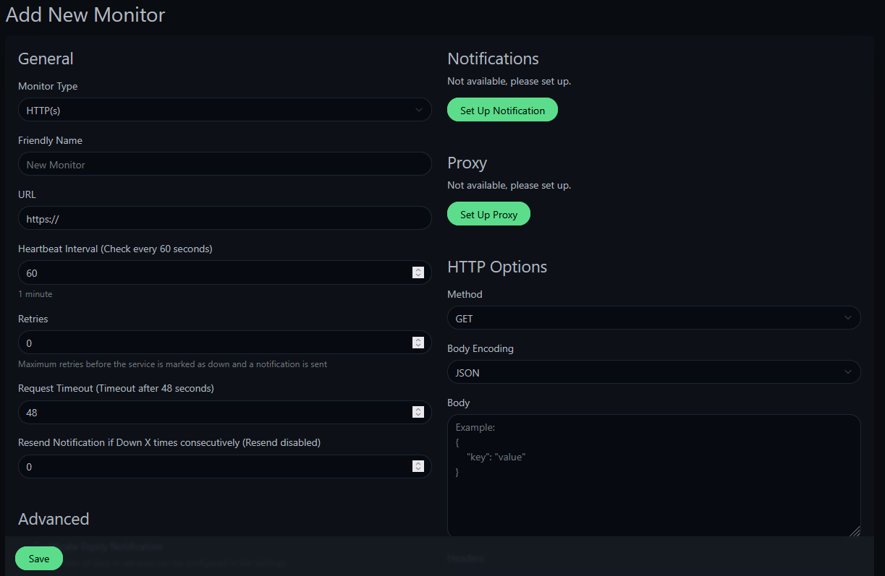
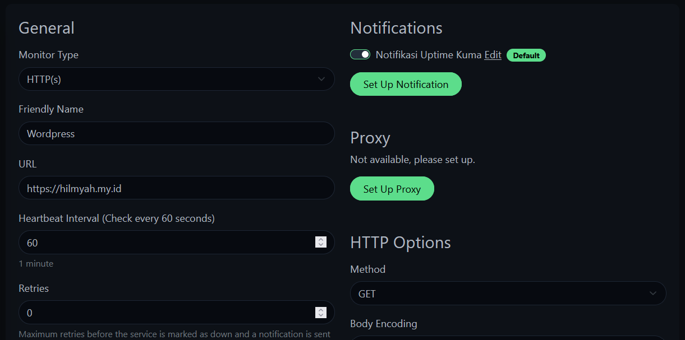
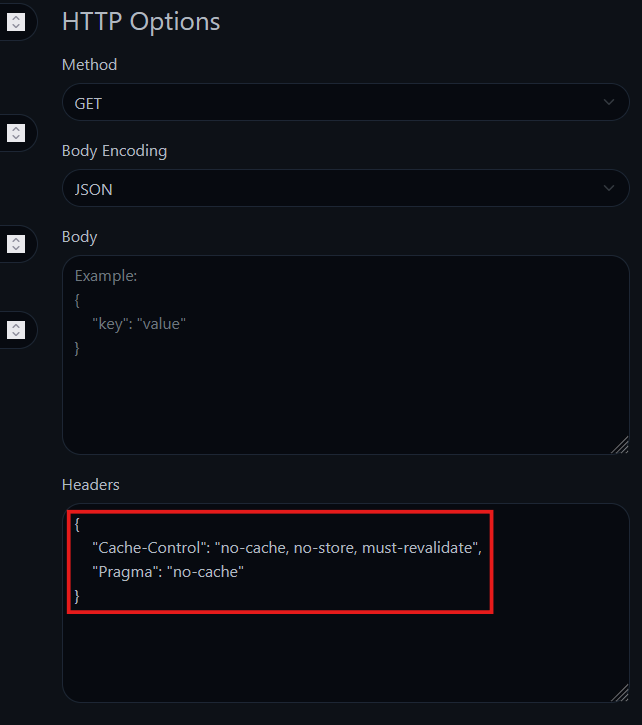
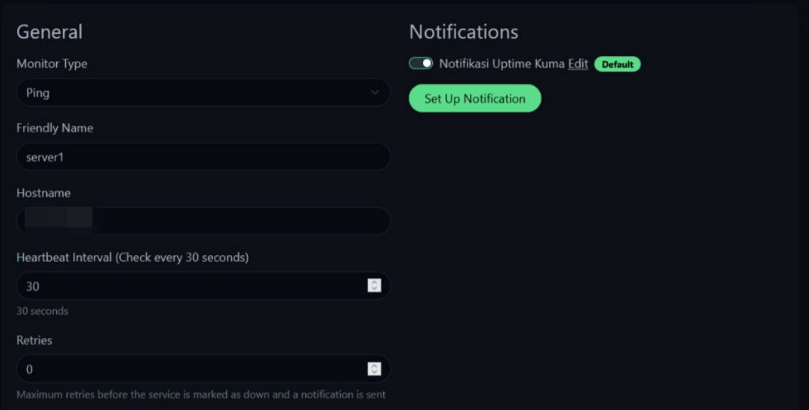
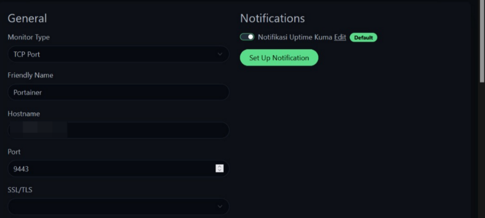
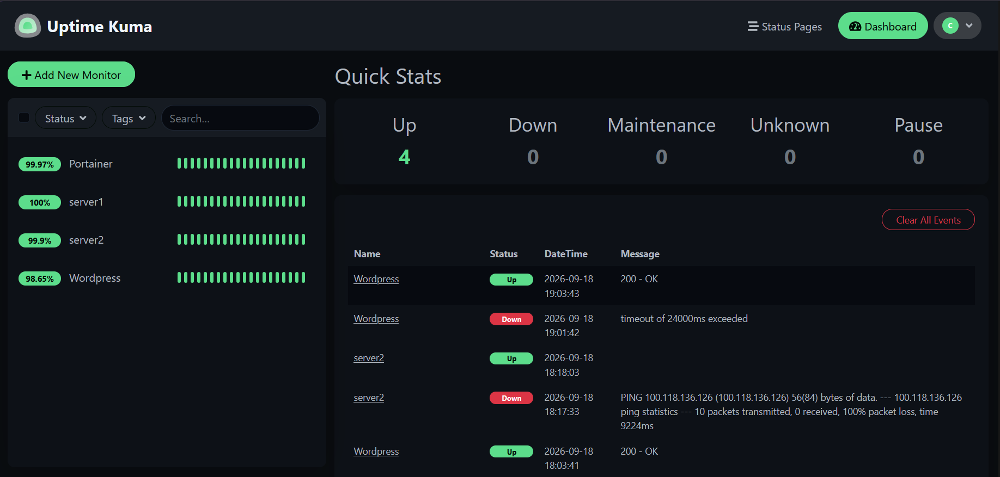

# Cara Menambahkan dan Mengonfigurasi Monitor di Uptime Kuma

Halo, Kawan Belajar! Setelah Uptime Kuma berhasil diinstal dan dashboard sudah dapat diakses, langkah selanjutnya adalah menambahkan **monitor** agar Uptime Kuma dapat mulai memantau status uptime dari website maupun service yang kamu miliki.

Pada panduan ini, kita akan membahas cara menambahkan tiga tipe monitor yang umum digunakan: **HTTP(s)** untuk memantau website, **TCP Port** untuk memantau service tertentu pada server lain, dan **Ping** untuk memantau apakah sebuah server aktif (up) atau tidak.

> **Catatan:** Panduan ini merupakan lanjutan dari artikel instalasi Uptime Kuma, baik metode [Docker](Cara_Instalasi_Uptime_Kuma_di_Linux_dengan_Docker.md) maupun [NPM (Non-Docker/Native)](Cara_Instalasi_Uptime_Kuma_di_Linux_dengan_NPM.md). Pastikan Uptime Kuma sudah terinstal dan akun admin sudah dibuat sebelum mengikuti langkah-langkah berikut.

## Persiapan Awal

Sebelum memulai, pastikan sudah memiliki:

1. Uptime Kuma yang sudah terinstal dan dapat diakses melalui dashboard, sesuai artikel instalasi sebelumnya.
2. Akun admin Uptime Kuma yang sudah login ke dashboard.
3. Alamat website (untuk monitor HTTP(s)) dan/atau IP Address server lain beserta port service yang ingin dipantau (untuk monitor TCP Port dan Ping).

---

## 1. Membuka Halaman Tambah Monitor

Pada dashboard Uptime Kuma, klik tombol **Add New Monitor** di bagian kiri atas.

<p align="center">

  <br>
  <em>Gambar 1: Klik Add New Monitor</em>
</p>

Halaman **Add New Monitor** akan terbuka, menampilkan form **General** di sisi kiri serta panel **Notifications** dan **Proxy** di sisi kanan.

<p align="center">

  <br>
  <em>Gambar 2: Halaman Add New Monitor</em>
</p>

Field umum yang tersedia pada setiap tipe monitor:

* **Monitor Type**: menentukan tipe monitor (HTTP(s), TCP Port, Ping, dan lainnya).
* **Friendly Name**: nama monitor yang mudah dikenali pada dashboard.
* **Heartbeat Interval**: jeda waktu antar pengecekan, dalam detik.
* **Retries**: jumlah percobaan ulang maksimum sebelum service dinyatakan down dan notifikasi dikirim.

Pada panel **Notifications**, notifikasi yang sudah dikonfigurasi sebelumnya dapat langsung diaktifkan untuk monitor ini menggunakan toggle. Apabila belum ada notifikasi yang dikonfigurasi, klik **Set Up Notification** untuk membuatnya, atau lihat artikel [Cara Setup Notifikasi pada Uptime Kuma ke Email Kilat Hosting 2.0](Cara_Setup_Notifikasi_pada_Uptime_Kuma_ke_Email_Kilat_Hosting.md).

---

## 2. Monitor Tipe HTTP(s) — Memantau Website

Tipe monitor ini digunakan untuk memantau status uptime sebuah website melalui protokol HTTP/HTTPS.

Isi konfigurasi berikut pada form **General**:

* **Monitor Type**: `HTTP(s)`.
* **Friendly Name**: nama monitor, contoh `Wordpress`.
* **URL**: alamat website yang ingin dipantau, contoh `https://domainkamu.com`.
* **Heartbeat Interval**: jeda waktu antar pengecekan dalam detik (contoh `60`).
* **Retries**: jumlah percobaan ulang sebelum monitor dinyatakan down (contoh `0` apabila ingin monitor langsung dinyatakan down pada kegagalan pertama).

<p align="center">

  <br>
  <em>Gambar 3: Konfigurasi Monitor HTTP(s)</em>
</p>

Klik **Save** untuk menyimpan monitor.

### 2.1 Bypass Cache pada Monitor HTTP(s) (Cloudflare / Nginx Proxy)

Apabila domain yang dipantau menggunakan Cloudflare atau reverse proxy dengan cache aktif, hasil pengecekan Uptime Kuma berisiko membaca response dari cache, bukan kondisi website yang sebenarnya. Hal ini dapat menyebabkan monitor tidak mendeteksi downtime secara akurat.

Untuk mengatasinya:

1. Bersihkan cache CDN (**Purge All Cache**) atau aktifkan **Development Mode** pada Cloudflare.
2. Pada Uptime Kuma, buka monitor yang bersangkutan, klik **Edit**, lalu scroll ke bagian **HTTP Options**.
3. Pada field **Headers**, tambahkan HTTP Headers berikut dalam format JSON untuk mencegah balasan dari cache:

```json
{
  "Cache-Control": "no-cache, no-store, must-revalidate",
  "Pragma": "no-cache"
}
```

<p align="center">

  <br>
  <em>Gambar 4: Bypass Cache dengan HTTP Headers</em>
</p>

> **Catatan:** Bagian **HTTP Options** pada monitor HTTP(s) juga menyediakan field **Method** (default `GET`), **Body Encoding**, dan **Body** untuk kebutuhan monitoring endpoint yang membutuhkan request body, namun field-field tersebut berada di luar cakupan panduan ini karena tidak digunakan pada monitor website biasa.

Klik **Save** setelah header ditambahkan.

---

## 3. Monitor Tipe Ping — Memantau Status Server

Tipe monitor ini digunakan untuk memastikan sebuah server aktif (up) atau tidak melalui ICMP (ping), tanpa memeriksa service tertentu yang berjalan di dalamnya.

Pada dashboard, klik **Add New Monitor**, lalu isi konfigurasi berikut:

* **Monitor Type**: `Ping`.
* **Friendly Name**: nama monitor, contoh `server1`.
* **Hostname**: IP Address publik server yang ingin dipantau, contoh `IP_VPS`.
* **Heartbeat Interval**: jeda waktu antar pengecekan dalam detik, contoh `30`.
* **Retries**: jumlah percobaan ulang sebelum monitor dinyatakan down, contoh `0`.

<p align="center">

  <br>
  <em>Gambar 5: Konfigurasi Monitor Ping</em>
</p>

Klik **Save** untuk menyimpan monitor.

> **Catatan:** Monitor tipe Ping dapat ditambahkan lebih dari satu untuk memantau beberapa server sekaligus, masing-masing dengan Hostname (IP Address) server yang berbeda.

---

## 4. Monitor Tipe TCP Port — Memantau Service pada Server Lain

Tipe monitor ini digunakan untuk memastikan sebuah port/service tertentu pada server lain dapat diakses, misalnya port aplikasi Portainer, database, atau service lainnya.

Pada dashboard, klik **Add New Monitor**, lalu isi konfigurasi berikut:

* **Monitor Type**: `TCP Port`.
* **Friendly Name**: nama monitor, contoh `Portainer`.
* **Hostname**: IP Address publik server yang menjalankan service tersebut, contoh `IP_VPS`.
* **Port**: nomor port service yang ingin dipantau, contoh `9443`.

<p align="center">

  <br>
  <em>Gambar 6: Konfigurasi Monitor TCP Port</em>
</p>

Klik **Save** untuk menyimpan monitor.

---

## 5. Memverifikasi Status Monitor

Setelah monitor ditambahkan, dashboard akan menampilkan seluruh monitor beserta status uptime-nya (`100%` untuk service yang selalu up sejak ditambahkan) dan grafik heartbeat berupa bar hijau (up) atau merah (down) pada setiap siklus pengecekan.

<p align="center">

  <br>
  <em>Gambar 7: Dashboard Menampilkan Seluruh Monitor</em>
</p>

Ulangi langkah 2, 3, atau 4 sesuai kebutuhan untuk menambahkan monitor lain.

---

## Langkah Selanjutnya

Setelah monitor berhasil ditambahkan, kamu dapat melanjutkan konfigurasi berikut:

* **Notifikasi**, agar mendapatkan peringatan otomatis melalui email saat monitor berubah status down maupun up kembali. Lihat artikel [Cara Setup Notifikasi pada Uptime Kuma ke Email Kilat Hosting 2.0](Cara_Setup_Notifikasi_pada_Uptime_Kuma_ke_Email_Kilat_Hosting.md).
* **Public Status Page**, untuk menampilkan status monitor secara publik, dapat dikelompokkan ke dalam beberapa grup/kategori. Lihat artikel [Cara Membuat Public Status Page di Uptime Kuma](Cara_Membuat_Public_Status_Page_di_Uptime_Kuma.md).

---

## Troubleshooting

### Monitor HTTP(s) Menunjukkan Status Up Meski Website Sedang Down

Periksa apakah domain yang dipantau menggunakan Cloudflare atau reverse proxy dengan cache aktif. Apabila iya, ikuti langkah pada bagian [Bypass Cache pada Monitor HTTP(s)](#21-bypass-cache-pada-monitor-https-cloudflare--nginx-proxy) agar Uptime Kuma tidak membaca response dari cache.

### Monitor TCP Port atau Ping Selalu Menunjukkan Status Down

Periksa hal berikut:

1. Pastikan IP Address pada field **Hostname** sudah benar dan server target dapat dijangkau dari VPS Uptime Kuma.
2. Khusus TCP Port, pastikan port yang dipantau memang sedang listen pada server target, dan tidak diblokir oleh firewall (UFW/security group) di sisi server target maupun di sisi VPS Uptime Kuma.
3. Khusus Ping, pastikan ICMP tidak diblokir oleh firewall pada jalur jaringan menuju server target.

## Kesimpulan

Dengan menambahkan monitor tipe HTTP(s), TCP Port, dan Ping, Uptime Kuma sudah dapat memantau status uptime website maupun service pada server lain secara mandiri. Konfigurasi tambahan seperti HTTP Headers untuk bypass cache dapat digunakan agar hasil monitoring HTTP(s) tetap akurat meski domain berada di belakang CDN atau reverse proxy. Langkah selanjutnya adalah mengonfigurasi notifikasi dan Public Status Page agar monitoring berjalan optimal.

## Referensi

- [Uptime Kuma Official Repository](https://github.com/louislam/uptime-kuma/)