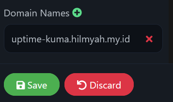
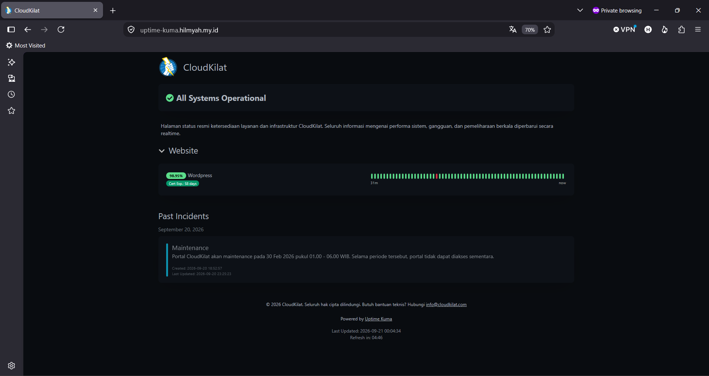

# Cara Mengakses Status Page Uptime Kuma melalui Domain Sendiri

Halo, Kawan Belajar! Secara default, Public Status Page pada Uptime Kuma diakses melalui `IP_VPS:3001/status/SLUG`, mengikuti alamat instance Uptime Kuma itu sendiri. Alamat ini kurang praktis untuk dibagikan kepada pelanggan atau klien, baik dari sisi kemudahan diingat maupun dari sisi keamanan (port `3001` sekaligus mengarah ke dashboard admin).

Pada panduan ini akan dibahas cara menampilkan status page pada domain atau subdomain sendiri beserta HTTPS, menggunakan reverse proxy Nginx dan SSL Let's Encrypt, sehingga status page dapat dibagikan sebagai `https://status.domainkamu.com` tanpa menyertakan port maupun path `/status/SLUG`.

> **Catatan:** Panduan ini merupakan lanjutan dari artikel [Cara Membuat Public Status Page di Uptime Kuma](https://kb.cloudkilat.id/uptime-kuma/cara-membuat-public-status-page-di-uptime-kuma). Pastikan status page sudah dibuat dan monitor yang relevan sudah ditambahkan sebelum mengikuti langkah-langkah berikut.

## Persiapan Awal

Sebelum memulai, pastikan sudah memiliki:

1. Uptime Kuma yang sudah terinstal beserta minimal satu Public Status Page yang sudah dibuat.
2. Domain atau subdomain khusus untuk status page, contoh `status.domainkamu.com`, beserta akses ke pengaturan DNS-nya.
3. A record pada domain tersebut sudah diarahkan (pointing) ke IP Address publik VPS Uptime Kuma.
4. Port `80/tcp` dan `443/tcp` dapat diakses dari internet menuju VPS Uptime Kuma.
5. Akses **Root** atau user dengan hak akses `sudo` pada VPS.

> **Penting:** Karena status page pada domain khusus umumnya dibagikan langsung kepada pelanggan atau klien, tinjau kembali monitor dan grup yang ditampilkan pada status page tersebut sebelum melanjutkan. Sertakan hanya monitor yang memang ditujukan untuk dilihat pelanggan (contoh: monitor website), dan jangan sertakan monitor untuk kebutuhan internal seperti panel manajemen VPS, database, maupun ping server generik, karena statistik dan nama monitor tersebut akan ikut terekspos secara publik. Pengaturan grup dan monitor pada status page dapat disesuaikan kembali melalui halaman editor sesuai artikel [Cara Membuat Public Status Page di Uptime Kuma](https://kb.cloudkilat.id/uptime-kuma/cara-membuat-public-status-page-di-uptime-kuma).

---

## 1. Install Nginx

Apabila Nginx belum terinstal pada VPS, install terlebih dahulu:

```bash
apt update
apt install nginx -y
```

---

## 2. Membuat Konfigurasi Reverse Proxy

Buat file konfigurasi virtual host:

```bash
nano /etc/nginx/conf.d/uptime-kuma.conf
```

Isi dengan konfigurasi berikut, ganti `status.domainkamu.com` dengan domain yang digunakan:

```nginx
server {
    listen 80;
    server_name status.domainkamu.com;

    location / {
        proxy_pass http://localhost:3001;
        proxy_http_version 1.1;
        proxy_set_header Upgrade $http_upgrade;
        proxy_set_header Connection "upgrade";
        proxy_set_header Host $host;
        proxy_set_header X-Real-IP $remote_addr;
        proxy_set_header X-Forwarded-For $proxy_add_x_forwarded_for;
        proxy_set_header X-Forwarded-Proto $scheme;

        proxy_set_header Sec-WebSocket-Key $http_sec_websocket_key;
        proxy_set_header Sec-WebSocket-Version $http_sec_websocket_version;
        proxy_set_header Sec-WebSocket-Extensions $http_sec_websocket_extensions;

        proxy_buffering off;
    }
}
```

Uji konfigurasi dan reload Nginx:

```bash
nginx -t
systemctl reload nginx
```

---

## 3. Memasang SSL Let's Encrypt

Install Certbot beserta plugin Nginx:

```bash
apt install certbot python3-certbot-nginx -y
```

Terbitkan sertifikat SSL untuk domain yang digunakan:

```bash
certbot --nginx -d status.domainkamu.com
```

Certbot akan menambahkan konfigurasi HTTPS pada file virtual host secara otomatis, termasuk pengalihan dari HTTP ke HTTPS apabila opsi tersebut dipilih pada saat proses berjalan.

---

## 4. Mendaftarkan Domain pada Status Page

Buka halaman editor Public Status Page yang ingin dihubungkan ke domain tersebut, lalu pada panel kiri bagian **Domain Names**, klik ikon tambah (+) dan masukkan domain yang sudah dikonfigurasi pada langkah 1-3, contoh `uptime-kuma.hilmyah.my.id`.

<p align="center">

  <br>
  <em>Gambar 1: Menambahkan Domain pada Status Page</em>
</p>

Klik **Save** untuk menyimpan perubahan, atau **Discard** untuk membatalkannya.

---

## 5. Uji Coba Akses melalui Domain

Akses domain tersebut melalui browser. Status page akan langsung tampil pada domain yang didaftarkan, tanpa perlu menyertakan path `/status/SLUG`.

<p align="center">

  <br>
  <em>Gambar 2: Status Page Diakses melalui Domain Sendiri</em>
</p>

Pastikan seluruh grup, monitor, dan riwayat Past Incidents yang tampil pada domain tersebut memang sudah sesuai untuk dilihat pelanggan, sesuai catatan pada bagian [Persiapan Awal](#persiapan-awal).

---

## Troubleshooting

### Domain Menampilkan Halaman Login atau Error 404

Periksa hal berikut:

1. Pastikan domain sudah ditambahkan pada bagian **Domain Names** di editor status page, kemudian disimpan dengan tombol **Save**.
2. Pastikan A record domain sudah mengarah ke IP Address publik VPS Uptime Kuma dan propagasi DNS sudah selesai.
3. Pastikan `server_name` pada konfigurasi Nginx sama persis dengan domain yang diakses.

### Gagal Menerbitkan Sertifikat SSL dengan Certbot

Periksa hal berikut:

1. Pastikan A record domain sudah mengarah ke IP Address publik VPS dan propagasi DNS sudah selesai sebelum menjalankan Certbot, karena proses validasi domain dilakukan melalui koneksi HTTP ke VPS.
2. Pastikan port `80/tcp` dapat diakses dari internet, karena Certbot melakukan validasi domain (HTTP-01 challenge) melalui port tersebut.
3. Pastikan konfigurasi Nginx pada langkah 2 sudah aktif (`nginx -t` tidak menunjukkan error) sebelum menjalankan Certbot.

## Kesimpulan

Dengan reverse proxy Nginx, SSL Let's Encrypt, dan pengaturan **Domain Names** pada editor Public Status Page, status layanan Uptime Kuma dapat diakses langsung melalui domain sendiri secara aman (HTTPS) tanpa menyertakan port maupun path tambahan, sehingga lebih mudah dibagikan dan terlihat lebih profesional di mata pelanggan. Sebelum membagikan domain tersebut, pastikan monitor yang ditampilkan sudah ditinjau ulang agar hanya memuat informasi yang memang ditujukan untuk pelanggan.

CloudKilat menyediakan layanan Kilat VM beserta domain yang dapat digunakan untuk menjalankan Uptime Kuma sekaligus menampilkan Public Status Page pada domain sendiri. Layanan tersebut juga didukung oleh tim support CloudKilat dengan pelayanan selama 7x24 jam apabila mengalami kendala pada konfigurasi.

Terima kasih, sekian dan semoga bermanfaat.

## Referensi

- [Uptime Kuma Official Repository](https://github.com/louislam/uptime-kuma/)
- [Uptime Kuma - Reverse Proxy](https://github.com/louislam/uptime-kuma/wiki/Reverse-Proxy)
