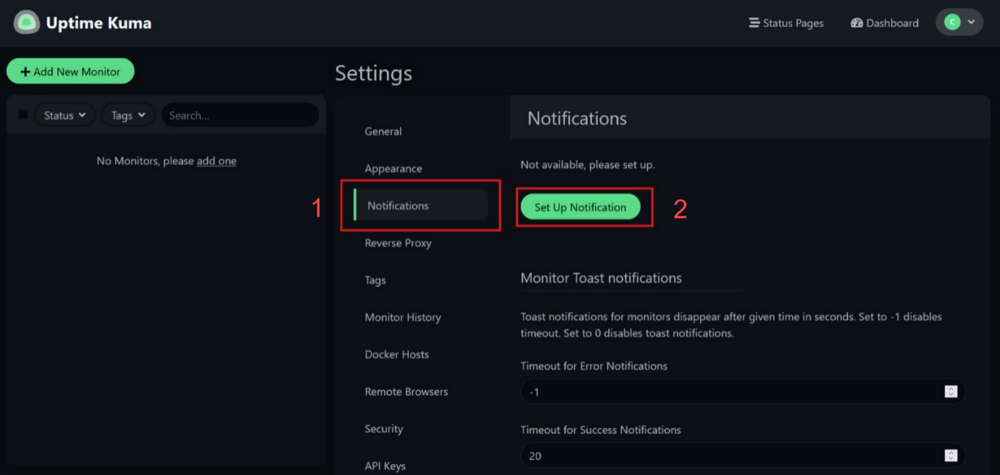
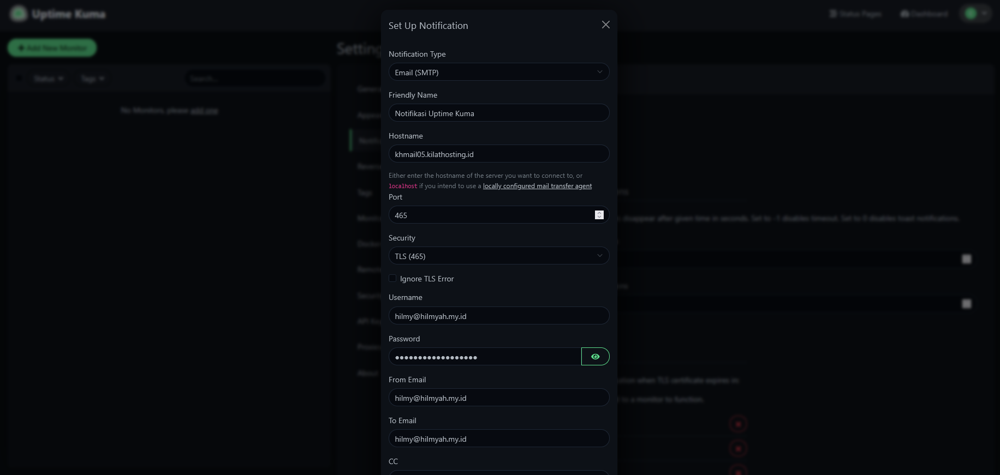
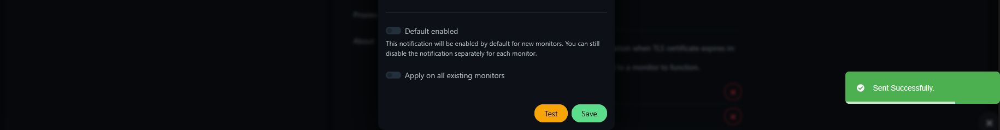
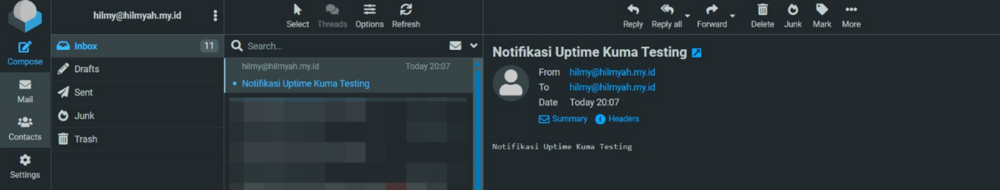
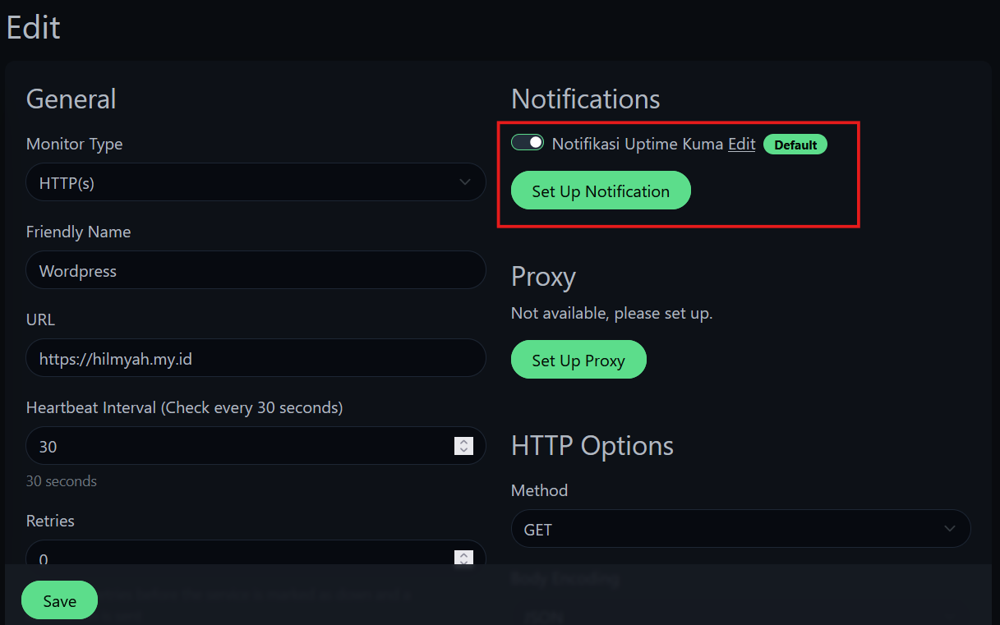
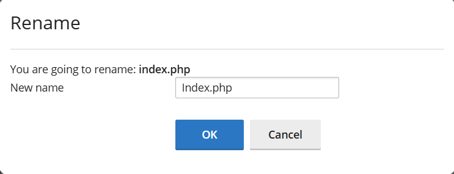
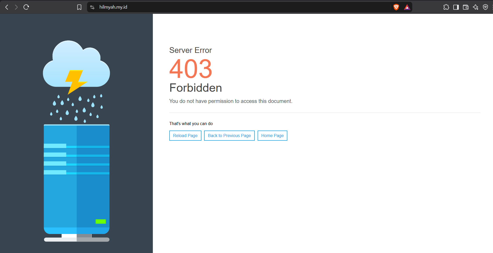
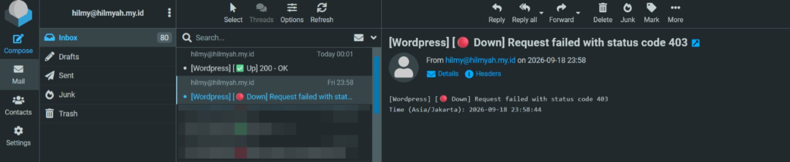
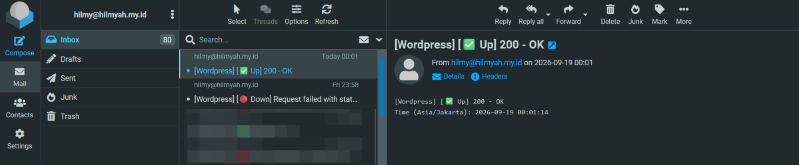

# Cara Setup Notifikasi pada Uptime Kuma ke Email Kilat Hosting 2.0

Halo, Kawan Belajar! Monitor yang sudah ditambahkan pada Uptime Kuma memang menampilkan status uptime secara realtime pada dashboard, namun status tersebut hanya terlihat apabila dashboard sedang dibuka. Agar mendapatkan peringatan otomatis saat sebuah layanan berubah status **down** maupun kembali **up**, Uptime Kuma perlu dihubungkan ke channel notifikasi.

Pada panduan ini, notifikasi Uptime Kuma akan dikonfigurasi menggunakan tipe **Email (SMTP)** dengan akun email dari layanan **Kilat Hosting 2.0**, mulai dari pembuatan notifikasi, pengujian pengiriman email, pengaktifan notifikasi pada monitor, hingga verifikasi email notifikasi down dan up.

> **Catatan:** Panduan ini merupakan lanjutan dari artikel instalasi Uptime Kuma, baik metode [Docker](https://kb.cloudkilat.id/uptime-kuma/cara-instalasi-uptime-kuma-di-linux-dengan-docker) maupun [NPM (Non-Docker/Native)](https://kb.cloudkilat.id/uptime-kuma/cara-instalasi-uptime-kuma-di-linux-dengan-npm-non-docker-native), serta artikel [Cara Menambahkan dan Mengonfigurasi Monitor di Uptime Kuma](https://kb.cloudkilat.id/uptime-kuma/cara-menambahkan-dan-mengonfigurasi-monitor-di-uptime-kuma).

## Persiapan Awal

Sebelum memulai, pastikan sudah memiliki:

1. Uptime Kuma yang sudah terinstal dan dapat diakses melalui dashboard, sesuai artikel instalasi sebelumnya.
2. Akun admin Uptime Kuma yang sudah login ke dashboard.
3. Akun email aktif pada layanan **Kilat Hosting 2.0** beserta password-nya, yang akan digunakan sebagai akun pengirim (SMTP authentication).
4. **Hostname mail server** sesuai yang tertera pada dashboard Kilat Hosting 2.0 milikmu, dengan format `khmail0#.kilathosting.id`.
5. Koneksi keluar (outbound) port `465/tcp` dari VPS Uptime Kuma tidak diblokir oleh firewall.
6. Minimal satu monitor yang sudah ditambahkan pada Uptime Kuma. Monitor juga dapat dibuat setelah notifikasi selesai dikonfigurasi.

## Rangkuman Konfigurasi SMTP Kilat Hosting 2.0

| Parameter             | Nilai                                                  |
| --------------------- | ------------------------------------------------------ |
| **Notification Type** | `Email (SMTP)`                                         |
| **Hostname**          | `khmail0#.kilathosting.id`                             |
| **Port**              | `465`                                                  |
| **Security**          | `TLS (465)`                                            |
| **Username**          | Alamat email lengkap, contoh `emailkamu@domainkamu.com`|
| **Password**          | Password akun email tersebut                           |
| **From Email**        | Alamat email pengirim (sama dengan Username)           |
| **To Email**          | Alamat email tujuan penerima notifikasi                |

> **Catatan:** Angka pada `khmail0#` menyesuaikan dengan hostname halaman dashboard Kilat Hosting 2.0 masing-masing akun, sehingga hostname tidak boleh ditebak dan harus disalin sesuai informasi pada dashboard.

---

## 1. Membuka Halaman Set Up Notification

Pada dashboard Uptime Kuma, klik ikon profil di kanan atas, lalu pilih **Settings**. Pada halaman Settings, pilih menu **Notifications** (1), kemudian klik tombol **Set Up Notification** (2).

<p align="center">

  <br>
  <em>Gambar 1: Menu Notifications pada Halaman Settings</em>
</p>

Apabila belum pernah dikonfigurasi, bagian Notifications akan menampilkan keterangan `Not available, please set up.` Ini adalah kondisi normal.

> **Catatan:** Modal **Set Up Notification** yang sama juga dapat dibuka dari halaman **Add New Monitor** maupun **Edit Monitor**, melalui panel **Notifications** di sisi kanan. Pintu masuknya berbeda, namun form dan hasil konfigurasinya identik.

---

## 2. Konfigurasi Notifikasi Email (SMTP)

Pada modal **Set Up Notification**, isi konfigurasi berikut:

* **Notification Type**: `Email (SMTP)`.
* **Friendly Name**: nama notifikasi yang mudah dikenali, contoh `Notifikasi Uptime Kuma`.
* **Hostname**: hostname mail server Kilat Hosting 2.0, contoh `khmail05.kilathosting.id`.
* **Port**: `465`.
* **Security**: `TLS (465)`.
* **Ignore TLS Error**: biarkan tidak dicentang.
* **Username**: alamat email lengkap yang digunakan sebagai pengirim.
* **Password**: password akun email tersebut.
* **From Email**: alamat email pengirim, gunakan alamat yang sama dengan Username.
* **To Email**: alamat email tujuan yang akan menerima notifikasi.
* **CC**: opsional, diisi apabila notifikasi perlu dikirim ke alamat tambahan.

<p align="center">

  <br>
  <em>Gambar 2: Konfigurasi Notifikasi Email (SMTP)</em>
</p>

> **Catatan:** Nilai **From Email** sebaiknya sama dengan akun yang digunakan pada **Username**, karena mail server umumnya menolak pengiriman dengan alamat pengirim yang berbeda dari akun yang melakukan autentikasi.

Pada bagian bawah modal terdapat dua opsi tambahan:

* **Default enabled**: notifikasi ini otomatis aktif pada setiap monitor baru yang dibuat. Notifikasi tetap dapat dinonaktifkan per monitor.
* **Apply on all existing monitors**: menerapkan notifikasi ini ke seluruh monitor yang sudah ada saat ini.

Aktifkan salah satu atau keduanya sesuai kebutuhan. Apabila kedua opsi dibiarkan nonaktif, notifikasi harus diaktifkan secara manual pada tiap monitor seperti pada langkah 4.

---

## 3. Menguji Pengiriman Email dengan Tombol Test

Sebelum menyimpan, klik tombol **Test** untuk memastikan kredensial SMTP sudah benar. Apabila konfigurasi valid, Uptime Kuma akan menampilkan notifikasi `Sent Successfully.` di sisi kanan layar.

<p align="center">

  <br>
  <em>Gambar 3: Hasil Uji Coba Pengiriman Notifikasi</em>
</p>

Buka webmail atau email client pada alamat tujuan, lalu pastikan email uji coba dengan subjek `Notifikasi Uptime Kuma Testing` sudah diterima.

<p align="center">

  <br>
  <em>Gambar 4: Email Uji Coba Diterima pada Inbox</em>
</p>

Setelah email uji coba diterima, klik **Save** untuk menyimpan notifikasi.

> **Catatan:** Keterangan `Sent Successfully.` hanya menandakan Uptime Kuma berhasil menyerahkan email ke mail server. Verifikasi pada inbox tetap diperlukan untuk memastikan email benar-benar sampai dan tidak masuk ke folder Junk/Spam.

---

## 4. Mengaktifkan Notifikasi pada Monitor

Notifikasi yang sudah disimpan belum otomatis berlaku pada monitor, kecuali opsi **Default enabled** atau **Apply on all existing monitors** diaktifkan pada langkah sebelumnya.

Untuk mengaktifkannya pada monitor yang sudah ada:

1. Buka monitor yang ingin dikonfigurasi dari daftar monitor pada dashboard.
2. Klik **Edit**.
3. Pada panel **Notifications** di sisi kanan, aktifkan toggle notifikasi yang sudah dibuat sebelumnya, contoh `Notifikasi Uptime Kuma`.
4. Klik **Save**.

<p align="center">

  <br>
  <em>Gambar 5: Mengaktifkan Notifikasi pada Monitor</em>
</p>

Ulangi langkah di atas untuk setiap monitor yang ingin dikirimi notifikasi.

> **Catatan:** Saat membuat monitor baru melalui **Add New Monitor**, jangan lupa mengaktifkan toggle notifikasi pada panel **Notifications** sebelum menekan **Save**, karena monitor tanpa notifikasi aktif tidak akan mengirim email meskipun konfigurasi SMTP sudah benar.

---

## 5. Menguji Notifikasi Down dan Up

Pengujian dilakukan dengan membuat layanan yang dipantau berada pada kondisi down untuk sementara, lalu mengembalikannya seperti semula. Metode simulasinya menyesuaikan tempat layanan tersebut berjalan, misalnya:

* **Website pada layanan hosting dengan control panel**: ubah nama file utama website (contoh `index.php` menjadi `Index.php`) melalui **File Manager**, sehingga website kehilangan halaman utamanya.
* **Website atau service pada VPS yang dikelola sendiri**: hentikan sementara service terkait melalui SSH, contoh `systemctl stop nginx`, `systemctl stop apache2`, atau service lain sesuai monitor yang diuji.

Contoh berikut menggunakan metode perubahan nama file melalui File Manager:

<p align="center">

  <br>
  <em>Gambar 6: Mengubah Nama File Utama Website</em>
</p>

Akses website melalui browser untuk memastikan kondisi down sudah terjadi, pada contoh ini website menghasilkan `403 Forbidden`.

<p align="center">

  <br>
  <em>Gambar 7: Website Dalam Kondisi Down</em>
</p>

Tunggu hingga Uptime Kuma melakukan pengecekan berikutnya sesuai nilai **Heartbeat Interval** dan **Retries** pada monitor tersebut. Setelah monitor dinyatakan down, email notifikasi akan diterima dengan subjek berisi nama monitor, status Down, dan penyebabnya.

<p align="center">

  <br>
  <em>Gambar 8: Email Notifikasi Saat Monitor Down</em>
</p>

Kembalikan layanan ke kondisi normal (kembalikan nama file semula atau jalankan kembali service yang dihentikan). Pada pengecekan berikutnya, monitor akan kembali berstatus up dan email notifikasi pemulihan akan diterima.

<p align="center">

  <br>
  <em>Gambar 9: Email Notifikasi Saat Monitor Kembali Up</em>
</p>

Dengan diterimanya kedua email tersebut, konfigurasi notifikasi Uptime Kuma ke Email Kilat Hosting 2.0 sudah berjalan sesuai harapan.

---

## Langkah Selanjutnya

Setelah notifikasi aktif, konfigurasi berikutnya yang dapat dilakukan adalah **Public Status Page**, untuk menampilkan status layanan secara publik kepada pengguna atau klien. Lihat artikel [Cara Membuat Public Status Page di Uptime Kuma](https://kb.cloudkilat.id/uptime-kuma/cara-membuat-public-status-page-di-uptime-kuma).

---

## Troubleshooting

### Tombol Test Menghasilkan Error Autentikasi

Periksa hal berikut:

1. Pastikan **Username** diisi dengan alamat email lengkap (`user@domainkamu.com`), bukan hanya bagian sebelum tanda `@`.
2. Pastikan password yang digunakan adalah password akun email tersebut, bukan password login dashboard hosting.
3. Pastikan akun email memang sudah dibuat dan aktif pada layanan Kilat Hosting 2.0.

### Tombol Test Menghasilkan Timeout atau Connection Refused

Periksa hal berikut:

1. Pastikan **Hostname** sesuai dengan yang tertera pada dashboard Kilat Hosting 2.0 (`khmail0#.kilathosting.id`), bukan hostname umum seperti `mail.domainkamu.com` yang belum tentu mengarah ke server yang sama.
2. Pastikan kombinasi **Port** `465` dan **Security** `TLS (465)` sudah sesuai.
3. Pastikan koneksi keluar ke port `465` tidak diblokir oleh firewall pada VPS Uptime Kuma. Uji dari VPS dengan perintah berikut:

```bash
openssl s_client -connect khmail0#.kilathosting.id:465 -quiet
```

Ganti `khmail0#` sesuai hostname yang digunakan. Koneksi yang berhasil akan menampilkan informasi sertifikat TLS.

### Test Berhasil, Namun Email Tidak Diterima

Periksa hal berikut:

1. Periksa folder **Junk/Spam** pada mailbox tujuan.
2. Pastikan **From Email** sama dengan akun pada **Username**, karena alamat pengirim yang berbeda dari akun autentikasi umumnya ditolak atau difilter.
3. Pastikan alamat pada **To Email** sudah benar.

### Monitor Berubah Status Down, Namun Email Tidak Terkirim

Pastikan toggle notifikasi sudah diaktifkan pada monitor yang bersangkutan melalui **Edit Monitor**, sesuai langkah 4. Notifikasi yang tersimpan pada Settings tidak berlaku pada monitor lama apabila opsi **Apply on all existing monitors** tidak diaktifkan.

### Website Sudah Down, Namun Monitor Tetap Berstatus Up

Periksa nilai **Retries** pada monitor, karena notifikasi baru dikirim setelah jumlah percobaan ulang terlampaui. Apabila domain berada di belakang Cloudflare atau reverse proxy dengan cache aktif, ikuti langkah bypass cache pada artikel [Cara Menambahkan dan Mengonfigurasi Monitor di Uptime Kuma](https://kb.cloudkilat.id/uptime-kuma/cara-menambahkan-dan-mengonfigurasi-monitor-di-uptime-kuma).

## Kesimpulan

Dengan mengonfigurasi notifikasi tipe Email (SMTP) menggunakan akun email Kilat Hosting 2.0, Uptime Kuma dapat mengirimkan peringatan otomatis setiap kali monitor berubah status down maupun kembali up, tanpa perlu memantau dashboard secara manual. Pengujian melalui tombol Test memastikan kredensial SMTP sudah benar, sedangkan simulasi kondisi down memastikan notifikasi benar-benar terkirim pada kondisi nyata. Langkah selanjutnya adalah membuat Public Status Page agar status layanan dapat ditampilkan secara publik.

CloudKilat menyediakan layanan Kilat Hosting 2.0 dengan fitur email hosting yang andal, sehingga dapat dimanfaatkan sebagai pengirim notifikasi otomatis seperti pada panduan ini. Layanan tersebut juga didukung oleh tim support CloudKilat dengan pelayanan selama 7x24 jam apabila mengalami kendala pada konfigurasi SMTP.

Terima kasih, sekian dan semoga bermanfaat.

## Referensi

- [Uptime Kuma Official Repository](https://github.com/louislam/uptime-kuma/)